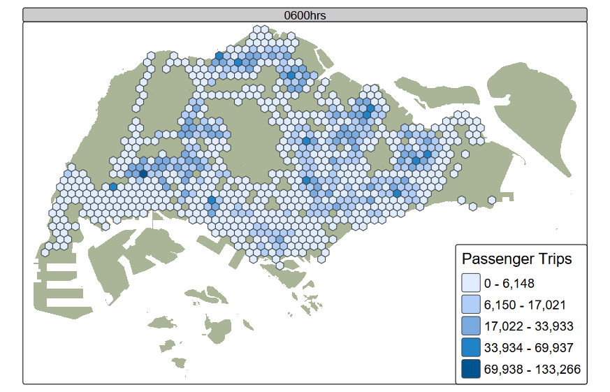
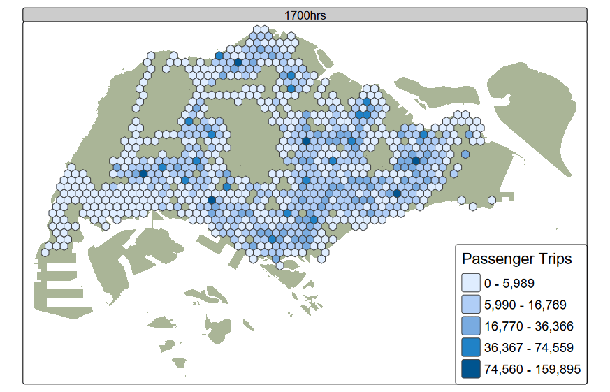
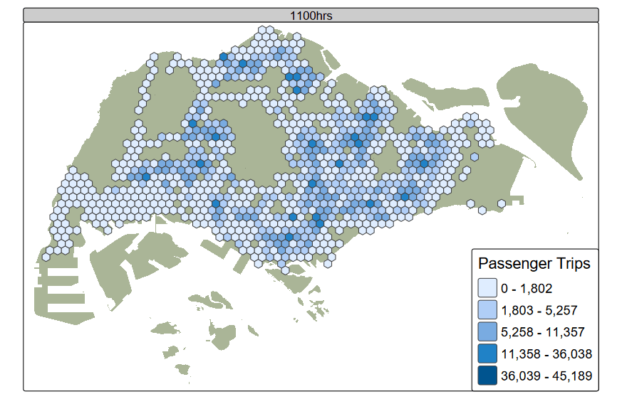

# Overview

Transit-Oriented Development (TOD) is a form of urban development which focuses on coordinating land use and development around transit stations. This commonly includes planning for high-density, mixed use and pedestrian-friendly walkable environments around transportation nodes such as bus stops and railway stations (Zhang et al., 2024). Passenger flow volumes from origin to destination bus stops can play a key role in urban bus route planning and optimisation, as well as land use planning to support efficient transit systems (Pan et al., 2017).

In this exercise, we will use spatio-temporal analysis techniques to analyse the distribution of passenger volume by origin bus stops across Singapore. The first section will prepare and visualise our dataset, which focuses on passenger volumes in August 2025 in the time intervals shown below. The second section utilises *Local Spatial Autocorrelation* techniques to identify hot spots, cold spots and spatial outliers in passenger bus volumes during these intervals. The third section performs *Emerging Hot Spot Analysis* (EHSA) to identify spatio-temporal clusters. This study will provide insights into the spatial and temporal dynamics of public bus usage and in Singapore, allowing us greater insight into Singapore's urban mobility patterns in the context of public busses. This in turn can contribute to decision-making on target areas for infrastructure improvements, service frequency adjustments and land-use planning.

| Peak hour period             | Bus tap on time |
|------------------------------|-----------------|
| Weekday morning peak         | 6am to 9am      |
| Weekday afternoon peak       | 5pm to 8pm      |
| Weekend/holiday morning peak | 11am to 8pm     |

# The Data

## Aspatial data

*Passenger Volume by Origin Destination Bus Stops* downloaded from [LTA DataMall](#0) will be used. It contains the number of trips by weekdays and weekends from origin to destination bus stops.

For this exercise, the data is collected in **August 2025**.

## Geospatial data

Two geospatial data will be used in this study, they are:

-   *Bus Stop Location* from LTA DataMall’s static dataset. It provides information about all the bus stops currently being serviced by buses, including the bus stop code (identifier) and location coordinates.

-   *Master Plan 2019 Subzone Boundary (No Sea)* from [Singapore’s open data portal](https://isss626-ay2025-26aug.netlify.app/data.gov.sg).

# Import R Packages

| Package | Use |
|----|:---|
| sf | Provides functions for importing processing and wrangling geospatial data |
| tidyverse | Contains several core packages such as ggplot2 for data visualisation, dplyr for data manipulation, tidyr for tidying data and readr for data import from file formats like CSV |
| tmap | provides functions for plotting cartographic quality thematic maps |
| knitr | provides elegant, flexible, and fast static table generation with R |
| DT | provides an R interface to the JavaScript library DataTables for creating interactive html tables |
| sfdep | For computing spatial weights, local spatial autocorrelation statistics, and emerging hotspot analysis |
| Kendall | For computing Kendall's rank correlation coefficient and performing Mann-Kendall trend tests |
| magick | provides a modern and simple toolkit for image processing in R, including gif animation generation |

```{r}
pacman::p_load(tidyverse, sf, sfdep, tmap, knitr, DT, Kendall, magick)
```

# Import data

::: panel-tabset
## Bus Stop Locations

`The following code chunk uses st_read()` of **sf** package to import the`Bus Stop` dataset into R environment. As`BusStop` EPSG code is incorrect (9001), we also use `st_transform` to convert it to 3414.

```{r}
BusStop <- st_read(dsn='data/LTADataMall/BusStopLocation_Aug2025', 'BusStop') %>%
  st_transform(crs=3414)
```

```{r}
st_crs(BusStop)
```

## Master Plan 2019 Subzones

The following code chunk also uses `st_read()` to import the Master Plan 2019 Subzone data into R. `st_zm()` removes Z (elevation) and M (measure) dimensions from the geospatial geometris, and `st_transform` corrects the crs of `mpsz_sf`

```{r}
mpsz_sf <- st_read("data/geospatial/MasterPlan2019SubzoneBoundaryNoSeaKML.kml") %>% 
  st_zm(drop = TRUE, what = "ZM") %>% st_transform(crs = 3414)
```

## Origin-Destination Bus Trips

The follwing code chunk uses `read_csv()` of **sf** package to import the csv file of passenger volume per bus stop into R environment. The output is R dataframe class.

```{r}
odbus = read_csv('data/aspatial/origin_destination_bus_202508.csv')
```
:::

# Data Wrangling

For reproducibility of results in this exercise, we will use the seed value '1234'

```{r}
set.seed(1234)
```

## Preparing Singapore boundaries data

In this section, we will clean up the `mpsz_sf` data for visualisation purposes in tmap, particularly to ensure that pop-ups when clicking on subzone areas in interactive tmap plots will be informative. The following code chunk builds the function extract_kml_field to extract REGION_N, PLN_AREA_N, SUBZONE_N from the Description field, and creates these columns in `mpsz_sf`

```{r}
#| eval: false
extract_kml_field <- function(html_text, field_name) {   
  if (is.na(html_text) || html_text == "") 
    return(NA_character_)         
  
  page <- read_html(html_text)   
  rows <- page %>% html_elements("tr")      
  value <- rows %>%     
    keep(~ html_text2(html_element(.x, "th")) == field_name) %>%      html_element("td") %>%     
    html_text2()      
  
if (length(value) == 0) NA_character_ else value 
}

mpsz_sf <- mpsz_sf %>%   
  mutate(     
    REGION_N = map_chr(Description, extract_kml_field, "REGION_N"),     
    PLN_AREA_N = map_chr(Description, extract_kml_field, "PLN_AREA_N"),     
    SUBZONE_N = map_chr(Description, extract_kml_field, "SUBZONE_N")) %>%   
  select(-Name, -Description) %>%   
  relocate(geometry, .after = last_col())

write_rds(mpsz_sf, 'data/rds/mpsz_sf.rds')
```

We can check the contents of the first 5 rows from mpsz below

```{r}
mpsz_sf=read_rds('data/rds/mpsz_sf.rds')
kable(head(mpsz_sf,5))
```

## Preparing Bus Stop data

First, we will use`qtm()` of **tmap** to visualise `BusStop` and `mpsz_sf`

```{r}
#| fig_width: 8
qtm(mpsz_sf)+
  qtm(BusStop, size = 0.1, add=TRUE)
```

From the above, we can observe that there are some bus stops outside of the Singapore boundaries (these are buses crossing the border to Johor Bahru). We can use `st_join` to join both *sf* objects by `st_within`, which will extract bus stops only in Singapore. We will use `BusStop` as the first argument to preserve the point layer.

```{r}
BusStop_in_SG <- st_join(
  BusStop, mpsz_sf,
  join=st_within, #returns TRUE for BusStop locations within the geometry of mpsz_sf
  left=FALSE #remove rows without matches 
) %>%
  select(c("BUS_STOP_N", "LOC_DESC", "geometry"))
```

When checking the plot again, we can see that bus stops outside of Singapore's main island have been removed

```{r}
#| fig_width: 8
qtm(mpsz_sf) +
qtm(BusStop_in_SG, size=0.1, add=TRUE)
```

### Duplicates in BusStop_in_SG

To ensure our data is clean, we will also look for duplicates in our dataset of bus stops.

```{r}
BusStop_in_SG %>%
  st_drop_geometry %>%
  filter(duplicated(.))%>%
  select(c('BUS_STOP_N', 'LOC_DESC'))
```

The above code chunk reveals there are 7 repeated bus stops with different point geometry (See example below).

```{r}
BusStop_in_SG[BusStop_in_SG$BUS_STOP_N==43709,]%>%
  select(c('BUS_STOP_N', 'LOC_DESC','geometry'))
```

The above also reveals there is a BUS_STOP_N with value 'NA' and an empty point geometry. As this may cause issues with our dataset, we will remove this datapoint using `drop_na()` from **tidyr** package

```{r}
BusStop_in_SG <- BusStop_in_SG %>%
  drop_na(BUS_STOP_N)
```

The duplicated BUS_STOP_N may be due bus stops changing location in the middle of August, for reasons such as construction necessitating the movement of the bus stop. As the passenger volume trip data later is unable to differentiate exactly what date each trip occurred nor which point geography the trip originated from, we will assume that the changes in location are not significant. We will therefore use `distinct()` from **dplyr** package, which will only retain the first instance of any duplicate rows

```{r}
BusStop_in_SG <- BusStop_in_SG %>%
  distinct(BUS_STOP_N,.keep_all=TRUE)
```

## Creating analytical hexagon data

Next, we will derive the analytical hexagon to represent the traffic analysis zone. Using regularly shaped grids normalises the geographical area analysed, which mitigates issues from using irregular polygons, for example varying sizes and shapes which can skew analytical results. We will use hexagons as this shape has a low perimeter to area ratio of the polygon and can tessellate to form a continuous, evenly spaced grid.

For this exercise, we will create hexagons of 375m (the perpendicular distance between the centre of the hexagon and its edges) to represent the [traffic analysis zone (TAZ)](https://tmg.utoronto.ca/files/Reports/Traffic-Zone-Guidance_March-2021_Final.pdf). The following code chunk generates the analytical hexagons using `st_make_grid` of **sf** package.

```{r}
hexagon <- st_make_grid(mpsz_sf,
                        cellsize=750,
                        what='polygon',
                        square=FALSE)%>%
  st_as_sf()
```

### Filtering for relevant hexagons

From the quick plot of the hexagon data below using `qtm()`, we can observe that there are many hexagons which do not contain any bus stops. Furthermore, some hexagons are located outside the boundaries of Singapore's main island.

```{r}
#| fig_width: 8
qtm(hexagon)+
qtm(mpsz_sf, fill='darkolivegreen', fill_alpha=0.5, add=TRUE) +
qtm(BusStop_in_SG, size=0.1, add=TRUE)
```

The following code chunk creates a new column in `hexagon` which calculates the number of bus stops which intersect with each hexagon. It then filters the dataset to only retain rows with hexagons which contain bus stops.

```{r}
hexagon$busstop_count = lengths(st_intersects(
  hexagon, BusStop_in_SG
))

hexagon <- filter(hexagon, busstop_count>0) 
```

The plot below confirms that hexagons with no bus stops, including those which lie outside Singapore's boundaries, have been removed.

```{r}
#| fig_width: 8
qtm(mpsz_sf, fill='darkolivegreen', fill_alpha=0.5)+
  qtm(hexagon, add=TRUE)+
  qtm(BusStop_in_SG, size = 0.1, add=TRUE)
```

### Visualising distribution of bus stops in TAZ {#sec-bus-stops}

```{r}
#| code-fold: TRUE
#| fig_width: 8
tmap_mode('plot')
tm_shape(mpsz_sf %>% 
           st_transform(crs=4326))+ #ensure grid of plot will be in degrees of latitude and longitude
  tm_fill('darkolivegreen', fill_alpha=0.5, border.col='black', lwd=0.3)+
tm_shape(hexagon)+
  tm_fill('busstop_count',
          legend.hist=TRUE,
          border.col='black', lwd=0.3)+
tm_title("Distribution of Bus Stops across TAZs in Singapore")+
tm_compass(type="8star",  position=c("RIGHT", "BOTTOM")) +
tm_scale_bar(position=c("LEFT", "BOTTOM")) +
tm_grid(alpha=0.3)
```

From the plot above, we note that the distribution of bus stops across the TAZs studied displays a right skew. Over half the TAZs have 10 or less bus stops, and only a few TAZs have over 15 bus stops, with a maximum of 20 bus stops in a single TAZ.

### Assigning IDs to hexagons

Currently, `hexagon` consists of polygon geometries but no identification column. The following code chunk performs the following steps:

-   Removes `busstop_count` column to tidy up the attribute table
-   Creates column HEX_ID, which inserts sequential ID values with character H in front
-   Converts values in HEX_ID to factor data type
-   Views first few rows of `hexagon` to examine output for correctness

```{r}
hexagon$HEX_ID <- sprintf(
  "H%04d", seq_len(nrow(hexagon)))%>% 
  as.factor() 

kable(head(hexagon)) #view the table 
```

## Preparing trip generation data

First, the following code chunk removes unnecessary columns from `odbus` so that the dataset can be more easily processed by R. Columns are also renamed for interpretability and to make joining with the bus stop data more easy later. Since there are a finite number of values in BUS_STOP_N, we also convert the data in this column to categorical data.

```{r}
trips_raw <- odbus %>%
  select(c(ORIGIN_PT_CODE, DAY_TYPE, TIME_PER_HOUR, TOTAL_TRIPS))%>% 
  rename(c(BUS_STOP_N=ORIGIN_PT_CODE, HOUR_OF_DAY=TIME_PER_HOUR, TRIPS=TOTAL_TRIPS))
trips_raw$BUS_STOP_N <- as.factor(trips_raw$BUS_STOP_N)

kable(head(trips_raw)) 
```

Next, we create a new dataframe `bs_hex` pairing each row in `BusStop_in_SG` with the corresponding `HEX_ID` from `hexagon`. The following code chunk performs a spatial join between `BusStop_in_SG` and `hexagon` using `st_intersection` to find which bus stops fall within the boundaries of each hexagon, drops the geometry column to convert the object to a tibble data frame, then retains the columns of interest for our analysis.

```{r}
bs_hex <- st_intersection(
  BusStop_in_SG, hexagon) %>% 
  st_drop_geometry() %>% #drops hexagon geometry layer
  select (c(BUS_STOP_N, HEX_ID, LOC_DESC)) #select attributes of interest

```

The next code chunk then performs an inner join between the `trips_raw` and `bs_hex` to find rows where there is a matching `BUS_STOP_N`

```{r}
trips_raw <- inner_join(
                        trips_raw, 
                        bs_hex, 
                        by=join_by(BUS_STOP_N)
                        ) 
```

Next, the code chunk aggregates the data by HEX_ID, DAY_TYPE and HOUR_OF DAY to create two columns with `summarise()` :

1.  TRIPS: Total number of trips in that TAZ at that time
2.  BUS_STOPS: Names of all bus stops with at least one trip in that TAZ at that time

```{r}
trips <- trips_raw %>%
  group_by(HEX_ID, DAY_TYPE, HOUR_OF_DAY) %>%
  summarise(
    TRIPS = sum(TRIPS),
    BUS_STOPS = paste(unique(LOC_DESC), collapse=", ")
  )%>% 
    ungroup()
kable(head(trips))
```

### Extracting trips data for each time interval

The function below will extract the trips by origin data based on the time intervals. The expected arguments are

-   daytype: ‘WEEKDAY’ or ‘WEEKENDS/HOLIDAY’
-   timeinterval: c(8,10) if we want data from 8am to 11am.

With this function, we will compute the passenger trips generated by origin for the timeframes of interest specified earlier.

```{r}
get_origin <- function(daytype, timeinterval) {
  result <- trips %>%
    filter(DAY_TYPE == daytype) %>%
    filter(HOUR_OF_DAY >= timeinterval[1] & HOUR_OF_DAY <= timeinterval[2])%>%
  
  return(result)
}

origin_am <- get_origin('WEEKDAY', c(6, 9)) 
origin_pm <- get_origin('WEEKDAY', c(17, 20))
origin_hol <- get_origin('WEEKENDS/HOLIDAY', c(11, 20))
```

## Preparing spatio-temporal cubes

**sfdep** package uses the *spacetime* class to link a flat dataset with spatio-temporal information with the related geometry.This class lattices data for each geometry over the different time periods, by linking a data frame and an *sf* object by a shared location identifier column. A *spacetime* object is a spacetime cube if every location has a value for every time index. Therefore, we need to populate any missing values in our origin data (where there were no bus trips originating from bus stops in a HEX_ID at a particular hour) before creating the spacetime cube.

The following code chunk defines functions to perform the following:

-   create_sf:
    -   Create `template` with all combinations of unique values of HEX_ID from `hexagon` and column HOUR_OF_DAY from the input data frame
    -   Creates dataframe `st_df` by using `left_join()` from **dplyr** package to merge the `template` with the existing trips dataframe. Any unmatched rows from the trips dataframe (i.e. times where there were no trips originating from that HEX_ID) will be populated with NA values.
        -   As `DAY_TYPE`
        -   is no longer needed, it is removed from the data frame
    -   Replaces NA values in `TRIP` column of `st_df` with 0
    -   Uses `left_join()` from **dplyr** package to merge the attributes in `st_df` with `hexagon` sf
-   create_stcube():
    -   Create a spatio-temporal cube with the input sf, using `HEX_ID` as the location column and `HOUR_OF_DAY` as the time column.

    -   Prints the result of `is_spacetime_cube()` of **sfdep** package to confirm that the object created is a space time cube

    -   Returns the the `result` spacetime object.

```{r}
create_sf <- function(sf) {
  template <- expand.grid(HEX_ID = unique(hexagon$HEX_ID),
                        HOUR_OF_DAY = unique(sf$HOUR_OF_DAY)) %>%
    left_join(hexagon, ., by="HEX_ID")

  st_sf <- left_join(template, sf, by = c("HEX_ID", "HOUR_OF_DAY")) %>%
    select(-"DAY_TYPE")

  st_sf[is.na(st_sf)] <- 0
  
  st_sf <- st_as_sf(st_sf)
  
  return(st_sf)
}

create_stcube <- function(sf) {
  result<- spacetime(sf, hexagon,
                      .loc_col="HEX_ID",
                      .time_col="HOUR_OF_DAY", active="data")
  
  print(is_spacetime_cube(result))
  
  return(result)
}
```

Using the functions created above, we can create the spatio-temporal cubes for each time interval to be studied in this exercise.

```{r}
am_sf <- create_sf(origin_am)
am_spt <- create_stcube(am_sf)
pm_sf <- create_sf(origin_pm)
pm_spt <- create_stcube(pm_sf)
hol_sf <- create_sf(origin_hol)
hol_spt <- create_stcube(hol_sf)
```

# Geovisualisation and Analysis

## Bus Stops in each TAZ

The following code chunk creates and displays an interactive datatable to allow us to look up any TAZ of interest by HEX_ID.

```{r}
#|code-fold: true
bus_list <- bs_hex %>%
  group_by(HEX_ID)%>%
  summarise(BUS_STOPS = str_c(LOC_DESC, collapse = ", "),
            BUS_STOP_COUNT=length(unique(LOC_DESC)))
datatable(bus_list,,
          class = 'cell-border stripe')

```

## Distribution maps

In this section, we will visualise the distribution map of total trips originating from each hexagon during each time interval studied.

The following code chunk aggregates all trips for each hexagon under `TRIPS` and lists the bus stops from that hexagon which was the origin of at least one trip under `BUS_STOPS`. Using this function allows us to aggregate the total trips per TAZ in each respective time frame studied.

```{r}
#| eval: false
get_cumulative <- function(sf){
  result <- sf %>%
  group_by(HEX_ID)%>%
  summarise(TRIPS=sum(TRIPS), 
            x=st_union(x),
            BUS_STOPS = str_c(unique(BUS_STOPS), collapse = ", ")%>%
                        strsplit(", ") %>%         
                        unlist() %>%               
                        unique() %>%              
                        paste(collapse = ", "),
            BUS_STOPS_COUNT=str_c(unique(BUS_STOPS), collapse = ", ")%>%
                        strsplit(", ") %>%         
                        unlist() %>%               
                        unique() %>% 
                        length())
  return(result)
}

cum_am <- get_cumulative(am_sf) 
cum_pm <- get_cumulative(pm_sf)
cum_hol <- get_cumulative(hol_sf)

write_rds(cum_am, 'data/rds/cum_am.rds')
write_rds(cum_pm, 'data/rds/cum_pm.rds')
write_rds(cum_hol, 'data/rds/cum_hol.rds')
```

The following code chunk creates the interactive distribution map of passenger trips originating from each TAZ for each time period. The subzone boundaries are also plotted to show which region/planning area/subzone the TAZs fall in. TAZs with outlier values of passenger trips are bordered in red.

```{r}
cum_am = read_rds('data/rds/cum_am.rds')
cum_pm = read_rds('data/rds/cum_pm.rds')
cum_hol = read_rds('data/rds/cum_hol.rds')

get_dist_map <-function(sf){
  stats <- boxplot.stats(sf$TRIPS)
  
  outlier_vals <- stats$out
  
  outlier_sf <- sf[sf$TRIPS %in% outlier_vals, ]
  
  result<-tm_shape(mpsz_sf)+
              tm_polygons(fill="darkolivegreen", fill_alpha=0.5)+
          tm_shape(sf)+
              tm_polygons(fill='TRIPS',
                          fill.scale = tm_scale_intervals(style = "fisher"),
                          popup.vars = c("HEX_ID", "TRIPS", "BUS_STOPS_COUNT")) +
              tm_layout(
                        legend.outside = FALSE,
                        legend.just = c("right", "bottom"), 
                        legend.position = c("right", "bottom")
                    )+
            tm_shape(outlier_sf) +
              tm_borders(col = "red", lwd = 1.5)+
            tm_view(set_zoom_limits = c(11,14))
  return(result)
}
```

The tmap_mode is set to ‘view’ mode. Clicking on a hexagon will reveal the HEX_ID and total tips originating from that TAZ during that time period. Individual hexagons of interest can be selected and searched for in the interactive data table above to examine details such as the bus stops listed within that hexagon.

::: panel-tabset
### Morning Peak

```{r}
tmap_mode('view')
get_dist_map(cum_am)
tmap_mode('plot')
```

### Evening Peak

```{r}
tmap_mode('view')
get_dist_map(cum_pm)
tmap_mode('plot')

```

### Weekend/Holidays

```{r}
tmap_mode('view')
get_dist_map(cum_hol)
tmap_mode('plot')
```
:::

**Observations:**

-   In general, the maps show a prominent right-skew of the passenger trip volume by origin in each TAZ. The outliers in each map are the TAZs with the highest number of passenger trips.
-   While most of the outliers are TAZs with relatively large number of bus stops (9 or more), there are some which have a unusually high passenger trip volume despite having only a few bus stops. For example, H0272 (one of the top left outlier hexagons) is consistently an outlier across all three time periods studied despite only having 3 bus stops.
-   Passenger trip volume along the borders of 'gaps' in the hexagons tends to be the lowest across all three time periods studied. In particular, TAZs in Tuas (in the lower left region) and Pioneer (in the upper left region) have low passenger volume across all time periods.
-   The range of passenger trips volume by origin for weekday peak evening hours is greater than that of the morning hours. This may indicate heavier bus transport usage in the weekday evening peak hours.

## Time-Series Animated Maps

```{r}
get_temporal_maps <- function(sf){
  sf$TIME <- sprintf("%02d00hrs", sf$HOUR_OF_DAY)
  
  result <- tm_shape(mpsz_sf)+
      tm_fill('darkolivegreen', fill_alpha=0.5)+
    tm_shape(sf)+
      tm_polygons(fill='TRIPS',
                  fill.scale = tm_scale_intervals(
                    style = "fisher"),
                  tm_legend(position=c('RIGHT', 'BOTTOM'),
                            title="Passenger Trips",
                            title.size=1.3,
                            text.size=1.1))+
      tm_facets(pages = "TIME", free.coords = FALSE)+
      tm_animate(frames="TIME", fps=2)
  return(result)
}
```

::: panel-tabset
### Weekday Morning peak

```{r}
#| eval: false

temporal_maps_am <- get_temporal_maps(am_sf)
tmap_animation(temporal_maps_am, filename = "images/am_temporal.gif")
```

```{r}

```

Passenger trip volume appears to peak around 7-8am based on this visualisation.

### Weekday Evening peak

```{r}
#| eval: false
temporal_maps_pm <- get_temporal_maps(pm_sf)
tmap_animation(temporal_maps_pm, filename = "images/pm_temporal.gif")
```

```{r}

```

Passenger trip volume appears to be highest at 5-6pm.

### Weekend/Holiday

```{r}
#| eval: false

temporal_maps_hol <- get_temporal_maps(hol_sf)
tmap_animation(temporal_maps_hol, filename = "images/holiday_temporal.gif")

```

```{r}


```

Some areas appear to remain as hotspots consistently throughout the day. At 7-8pm, there appears to be a marked decrease in passenger trip volumes across Singapore.
:::

**Observations:**

-   For both weekday morning and evening peak hours, it seems that passenger trip volume per TAZ generally decreases over the time period.
-   The TAZs with the highest passenger trip volume tend to be consistent across all three time periods studied.

# Local Indicators of Spatial Autocorrelation (LISA)

In this section, we will use LISA statistics to examine clusters of TAZs with high or low total trips originating from that TAZ, specifically the **Anselin Local Moran’s I** to examine clusters and spatial outliers. Spatial outliers refer to TAZs with values of total passenger trips that is significantly different from neighbouring TAZs. Local Moran's I was chosen over Getis-Ord Gi\*, as it can identify spatial patterns outside of only hot and cold spots.

The local Moran’s I index (I) is a relative measure which needs to be interpreted within the context of its computed z-score or p-value. Based on these local Moran’s I values and associated p-values, each TAZ can then be classified into 1 of 5 cluster/outlier types as follows([E.S.R. Institute, 2011](https://pmc.ncbi.nlm.nih.gov/articles/PMC5618106/#R2)):

1.  Not part of a cluster;
2.  Hot spot: High trip volume and surrounded by a cluster of high trip volume (High-High);
3.  Cold spot: Low trip volume and surrounded by a cluster of low trip volume (Low-Low);
4.  Spatial outlier: High trip volume and surrounded primarily by low trip volume (High-Low);
5.  Spatial outlier: Low trip volume is surrounded primarily by high trip volume (Low-High).

## Computing adaptive distance weights matrix

For this exercise, we will compute the spatial distance based weights matrix using the **k-nearest neighbours** method of constructing neighbour relationships. This allows us to select a fixed number k of nieghbours desired per TAZ, and the algorithm will select the k number of 'adjacent' neighbours based on a calculation of distance between each region.

This method is most appropriate as from the earlier visualisations, we can see that there are several unconnected regions of TAZs, including some hexagons which do not have any neighbours sharing a side or touching a corner. Furthermore, some areas in Singapore such as the central water catchment areas or military training areas also produce 'gaps' within the hexagons. Each hexagon therefore also does not have the same number of neighbours. Utilising the K-nearest neighbours method ensures that each hexagon has at least k-neighbours.

We will set each TAZ to have **18** neighbours. Firstly, this is given the skewed nature of the data from as seen from the earlier visualisations. Including more neighbours can reduce the influence of possible outliers in the data. Second, for TAZs which are fully surrounded by other TAZs, 18 will encompass all neighbours up to the second degree. If we choose a number of neighbours between 6 and 18, it will not be certain why. It should be noted that this high k value has the issue that this may incorporate third, fourth and even higher neighbours into the calculation of spatial autocorrelation, which will create an effect of smoothening out values.

The code chunk below creates a function to perform the following with a given sf:

-   [`st_knn(`](https://sfdep.josiahparry.com/reference/st_knn.html)`)` of **sfdep** will output a list of neighbours ‘nb’ for each row
-   based on ‘nb’ column, [st_weights()](https://sfdep.josiahparry.com/reference/st_weights.html) of **sfdep** will generate row-standardised spatial weights
    -   We will use row-standardised weight matrix (style=`"W"`). This ensures values of weights are between 0 and 1 and sum to 1 across the row. This facilities the interpretation of operation with the weights matrix as an averaging of neighboring values, and allows for the spatial parameter used in our analyses to be comparable between models.
-   ‘.before = 1’ will put the two columns at the front of the sf dataframe.

```{r}
get_weights <- function(df) {
  result <- df %>% 
    mutate(nb = st_knn(x,
                       k=18),
           wt = st_weights(nb,
                           style='W'),
           .before =1)
  return(result)
}
```

With the function above, we will calculate the weights matrix for the data from each time period.

```{r}
wm_am <- get_weights(cum_am)
wm_pm <- get_weights(cum_pm)
wm_hol <- get_weights(cum_hol)
```

## Local Moran's I

In this section we will compute the Local Moran's I for each TAZ and identify statistically significant spatial clusters/outliers given the following hypotheses:

-   H~0~ : The spatial distribution of passenger trips by origin is random

-   H~1~: The TAZ is part of a statistically significant cluster (high positive Z-score) or is a statistically significant outlier (high negative Z-score)

### Computing Local Moran's I

The following code chunk creates a function to calculate local_moran's I for each row of a given sf. The function performs the following:

-   Creates column `local_moran` using the [`local_moran()`](https://sfdep.josiahparry.com/reference/local_moran) function of **sfdep**. This function computes *Ii* values (local moran statistic), given a set of *zi* values (standard deviate of local morana statistic) and a listw object providing neighbour and weighting information for the polygon associated with the zi values. This will compute the local Moran's I of each sf at the TAZ level.

    -   As the function outputs results as a group, `unnest()` is necessary to access the output.

-   creates column LISA_cluster which generates the significant LISA cluster/outlier type by only taking cluster/outlier types of TAZs with p-value \< 0.05. TAZs with p-value \>= 0.05 are labelled "Insignificant.

    -   We will use `median` values from the `local_moran()` output given that our data displays a prominent right skew as discussed earlier.

```{r}
get_lisa <- function(sf){
  result <-  sf %>% 
    mutate(local_moran = local_moran(
      TRIPS, nb, wt, nsim=999),
      .before=1) %>%
    unnest(local_moran) %>%
    mutate(
      LISA_cluster = ifelse(
        p_ii_sim < 0.05,
        as.character(median), 
        "Insignificant"),
      LISA_cluster = factor(
        LISA_cluster,
        levels = c("Insignificant", "Low-Low", "Low-High", "High-Low", "High-High")
      )
    )
  
  return(result)
}
```

The code chunks below displays the following information in an interactive datatable for ease of sorting and examining details.

-   HEX_ID: ID of TAZ
-   TRIPS: Total passenger trips originating from that TAZ in the given timeframe
-   BUS_STOPS: names of bus stops in that TAZ
-   LISA_cluster: LISA cluster of the TAZ if significant, otherwise 'Insignificant'
-   p_ii_sim: the p-value computed using the Monte-Carlo simulation of Local Moran's I under assumption of spatial randomness

The datatable can be filtered or sorted to examine data of interest more closely, for example, TAZs which are high-low spatial outliers can be searched for by searching 'High-Low'.

The distribution of LISA clusters is also plotted for ease of visualisation.

:::::: panel-tabset
### Weekday Morning Peak

::: panel-tabset
#### Datatable

```{r}
#| code-fold: true
#| fig-width: 8
lisa_am <- get_lisa(wm_am)
lisa_am_dt <- lisa_am %>%
  select(c(HEX_ID, TRIPS, BUS_STOPS, LISA_cluster, p_ii_sim))

datatable(lisa_am_dt, class = 'cell-border stripe', options = list(pageLength = 5,
            columnDefs = list(list(
              targets =  c(6),  
              visible = FALSE)))
          )
```

#### Distribution of LISA clusters

```{r}
#| code-fold: true
ggplot(lisa_am, aes(x = LISA_cluster)) +
  geom_bar(fill = c(
          "grey80",      # Insignificant
          "blue",        # Low-Low
          "lightblue",   # Low-High
          "pink",        # High-Low
          "red"          # High-High
        )) +
  labs(
    title = "Distribution of LISA clusters",
    subtitle= "Weekday Morning Peak Hours (6-9am)",
    x = "LISA cluster",
    y = "count"
    ) +
  theme_minimal() +
  theme(plot.title = element_text(hjust = 0.5), plot.subtitle = element_text(hjust = 0.5))
  
```
:::

### Weekday Evening Peak

::: panel-tabset
#### Datatable

```{r}
#| code-fold: true

lisa_pm <-  get_lisa(wm_pm)
lisa_pm_dt <- lisa_pm %>%
  select(c(HEX_ID, TRIPS, BUS_STOPS, LISA_cluster, p_ii_sim))

datatable(lisa_pm_dt, class = 'cell-border stripe', options = list(pageLength = 5,
            columnDefs = list(list(
              targets =  6,  
              visible = FALSE)))
          )
```

#### Distribution of LISA Clusters

```{r}
#| code-fold: true

ggplot(lisa_pm, aes(x = LISA_cluster)) +
  geom_bar(fill = c(
          "grey80",      # Insignificant
          "blue",        # Low-Low
          "lightblue",   # Low-High
          "pink",        # High-Low
          "red"          # High-High
        )) +
  labs(
    title = "Distribution of LISA clusters",
    subtitle= "Weekday Evening Peak Hours (5-8pm)",
    x = "LISA cluster",
    y = "count"
    ) +
  theme_minimal() +
  theme(plot.title = element_text(hjust = 0.5), plot.subtitle = element_text(hjust = 0.5))

```
:::

### Weekend/holiday

::: panel-tabset
#### Datatable

```{r}
#| code-fold: true
lisa_hol <-  get_lisa(wm_hol)
lisa_hol_dt <- lisa_hol %>%
  select(c(HEX_ID, TRIPS, BUS_STOPS, LISA_cluster, p_ii_sim))

datatable(lisa_hol_dt, class = 'cell-border stripe', options = list(pageLength = 5,
            columnDefs = list(list(
              targets =  6,  
              visible = FALSE)))
          )
```

#### Distribution of LISA clusters

```{r}
#| code-fold: true
ggplot(lisa_hol, aes(x = LISA_cluster)) +
  geom_bar(fill = c(
          "grey80",      # Insignificant
          "blue",        # Low-Low
          "lightblue",   # Low-High
          "pink",        # High-Low
          "red"          # High-High
        )) +
  labs(
    title = "Distribution of LISA clusters",
    subtitle= "Weekend/Holidays (11am-8pm)",
    x = "LISA cluster",
    y = "count"
    ) +
  theme_minimal() +
  theme(plot.title = element_text(hjust = 0.5), plot.subtitle = element_text(hjust = 0.5))

```
:::
::::::

**Observations:**

-   Across all three time periods, majority of TAZs are not significant spatial clusters/outliers. Among the significant observations, clusters largely outweigh the outliers.

## Moran Scatterplots

In this section, we will examine the Moran scatterplots for each time period studied to analyse the local spatial autocorrelation for individual locations. This plot will identify spatial autocorrelation by visualising the relationship between the values of passenger trip originating from a TAZ and the average values of neighbouring TAZs. The plot's slope represents Moran's I, revealing patterns of the clusters and outliers.

The following code chunk creates a function to map a Moran scatterplot using standardised variables:

-   [`st_lag()`](https://sfdep.josiahparry.com/reference/st_lag) of **sfdep** package is used to calculates the spatial lag of `TRIPS` given a neighbor (i.e. `nb`) and weights list (i.e. `wt`).
    -   unnest is used to ungroup the result
-    [`scale()`](https://www.rdocumentation.org/packages/base/versions/3.6.2/topics/scale) is used to center and scales the variable around the median (given we have used median to determine the LISA clusters/outliers). Centering is done by subtracting the median (omitting NAs) of the corresponding columns, and scaling is done by dividing the (centered) variable by the interquartile range.
-   Creates a scatterplot to visualise the data

```{r}
get_msp <- function(lisa, subtitle){
  lisa <- lisa %>%
  mutate(lag_TRIPS = st_lag(
    TRIPS, nb, wt),
    .before = 1) %>%
  unnest(lag_TRIPS) %>%
    mutate(z_TRIPS = scale(TRIPS, center = median(TRIPS), scale = IQR(TRIPS)),
         z_lag_TRIPS = scale(lag_TRIPS, center = median(lag_TRIPS), scale = IQR(lag_TRIPS)),
         .before = 1)
  
  result <- ggplot(data = lisa, 
       aes(x = z_TRIPS, 
           y = z_lag_TRIPS, 
           color = median)) +
  geom_point(size = 2) +
  geom_smooth(method = "lm",
              formula = y ~ x + 0, #ensure that regression line passes through origin point
              se = FALSE, 
              color = "black") +
  geom_hline(yintercept=median(lisa$z_TRIPS), lty=2) + 
    geom_vline(xintercept=median(lisa$z_lag_TRIPS), lty=2) +
  scale_color_manual(
    values = c("High-High" = "red", 
               "Low-Low" = "blue",
               "Low-High" = "lightblue", 
               "High-Low" = "pink")) +
  labs(x = "Standardised Passenger Trips by Origin",
       y = "Standardised Spatial Lag of Passenger Trips by Origin",
       title = "Standardised Moran Scatterplot with LISA Quadrants",
       subtitle=subtitle) +
  theme_minimal()
}
```

::: panel-tabset
#### Weekday Morning Peak

```{r}
msp_am<-get_msp(lisa_am, "Weekday Morning Peak Hour")
msp_am
```

#### Weekday Evening Peak

```{r}
msp_pm<-get_msp(lisa_pm, "Weekday Evening Peak Hour")
msp_pm
```

#### Weekend/Holiday

```{r}
msp_hol<- get_msp(lisa_hol,"Weekend/Holidays")
msp_hol
```
:::

**Observations:**

-   For all three time periods studied, the slope of the regression line is positive. This indicates positive spatial autocorrelation, i.e., locations have similar passenger trip volume values to their neighbours.
    -   The above is further supported by the high concentration of points which are High-High or Low-Low.
    -   This indicates that spatial randomness of passenger trip volume by origin is unlikely
-   There appear to be many spatial outliers in our dataset based on the Moran's Scatterplot. However, from the earlier bar chart of the distribution of significant LISA clusters, the proportion of significant spatial clusters is much greater than the proportion of significant spatial outliers.

## LISA Cluster Choropleth Maps

Next, we will prepare the LISA Cluster choropleth maps to visualise the significant locations, color coded by their type of spatial autocorrelation.

```{r}
get_lisa_map <- function(lisa, title) {
  result<- tm_shape(mpsz_sf)+
    tm_polygons("SUBZONE_N", 
                fill="darkolivegreen",
                fill_alpha = 0.5, 
                fill.legend = tm_legend_hide())+
    tm_shape(lisa)+
    tm_polygons(
      fill = "LISA_cluster",
      fill.scale = tm_scale_categorical(
        values = c(
          "grey80",      # Insignificant
          "blue",        # Low-Low
          "lightblue",   # Low-High
          "pink",        # High-Low
          "red"          # High-High
        )
      ),
      fill.legend = tm_legend(
        title = "LISA Cluster",
        position = tm_pos_in("RIGHT", "BOTTOM")),
      popup.vars = c("HEX_ID", "TRIPS","LISA_cluster", "p_ii_sim")
    ) +
    tm_title(text=title,
           fontface = "bold")
  
  return(result)
  
}

lisa_map_am <- get_lisa_map(lisa_am,"Significant LISA categories of Passenger Trip Volume by Origin \nWeekday Morning Peak Hours (6-9am)" )
lisa_map_pm <- get_lisa_map(lisa_pm, "Significant LISA categories of Passenger Trip Volume by Origin \nWeekday Evening Peak Hours (5-8pm)" )
lisa_map_hol <- get_lisa_map(lisa_hol, "Significant LISA categories of Passenger Trip Volume by Origin \nWeekend/Holidays (11am-8pm)" )
```

::: panel-tabset
### Weekday Morning Peak

```{r}
#| fig-width: 8
tmap_mode('plot')
lisa_map_am

```

### Weekday Evening Peak

```{r}
#| fig-width: 8
tmap_mode("plot")
lisa_map_pm
```

### Weekend/holiday

```{r}
#| fig-width: 8
tmap_mode("plot")
lisa_map_hol

```
:::

**Observations:**

-   Cold spots
    -   Cold spots tend to appear in areas towards the borders of 'gaps' in the hexagons. There are no cold spot clusters that are central in sections of hexagons. The largest prominent cold spot cluster is in Tuas, which is in line with earlier observations.
    -   The consistency of many of the cold spot regions indicate low usage of bus stops in this regions as origin points for passenger trips. There are several possible reasons for this, including:
        -   **Lower bus stop density in these regions.** Comparing with the visualisation of bus stop distributions ([see @sec-bus-stops]), many of these TAZs which are identified as cold spots overlap with areas with relatively lower bus stop density. This may contribute to lower number of passenger trips originating from these TAZs.
        -   **Land use functions warrants lower population density and/or bus travel to/from these regions.** For example, Tuas and Pioneer are primarily major industrial areas, hence travel to/from these areas is likely for work. Public bus transport also not be a favoured form of travel to these regions. For example, workers at these industrial parks may favour company transport.
    -   Depending on the reason for the cold spots, this may warrant measures to improve bus stop accessibility in these regions, or serve as evidence that these areas can be of a lower priority in terms of frequency of bus services or transport development given low trip volumes.
-   Hot spots
    -   Unlike cold spots, the hot spots across all three time periods of study are present in central sections of hexagons.
    -   The general regions where hot spots appear across regions are similar across the three time periods. Notably however, the weekday morning peak hour period of study has the largest clusters of hotspots.
        -   A possible reason is that some of these hotspots may **overlap high density housing areas**, as travellers during morning peak hours are typically people departing home for work/school.
    -   These hot spots at each time period of study may indicate areas which should be prioritised when considering bus service scheduling and development of supporting transport infrastructure, given the evidence of high transport demand.
-   Spatial Outliers
    -   Some spatial outliers of note include the High-Low TAZs in Tuas. Since these are areas which show higher passenger trip volume than their neighbouring TAZs, this might indicate these areas should be prioritised in terms of ensuring sufficient bus services, such as including them in express routes which can stop by fewer bus stops in the neighbouring cold spot areas.

# Emerging Hot Spot Analysis EHSA

In this section, we will perform EHSA to identify and categorise the areas behaviour of clusters of high or low values of a phenomenon over time. EHSA combines the Getis-Ord Gi\* statistic for spatial clustering analysis, and the Mann-Kendall trend test, a non-parametric trend analysis, to detect trends in these clusters. This process allows for the detection of patterns such as new hot spots, persistent trends, or diminishing cold spots across different confidence levels. EHSA calculates the Gi\* of a location across time periods, and evaluates this series to categorise the pattern using the Mann-Kendall statistic. Together, these create 17 possible patterns to understand the pattern over time, as follows (:

| Pattern Name | Definition |
|----|----|
| **No Pattern Detected** | Does not fall into any of the hot or cold spot patterns defined below. |
| **New Hot Spot** | A location that is statistically significant hot spot for the final time step and has never been a statistically significant hot spot before. |
| **Consecutive Hot Spot** | A location with a single uninterrupted run of at least two statistically significant hot spot bins in the final time-step intervals. The location has never been a statistically significant hot spot prior to the final hot spot run and less than 90 percent of all bins are statistically significant hot spots. |
| **Intensifying Hot Spot** | A location that has been a statistically significant hot spot for 90 percent of the time-step intervals, including the final time step. In addition, the intensity of clustering of high counts in each time step is increasing overall and that increase is statistically significant. |
| **Persistent Hot Spot** | A location that has been statistically hot spot for 90 percent of the time-step intervals with no discernible trend in the intensity of clustering over time. |
| **Diminishing Hot Spot** | A location that has been a statistically significant hot spot for 90 percent of the time-step intervals, including the final time step. In addition, the intensity of clustering in each time step is decreasing overall and that decrease is statistically significant. |
| **Sporadic Hot Spot** | A statistically significant hot spot for the final time-step interval with a history of also being an on-again and off-again hot spot. Less than 90 percent of the time-step intervals have been statistically significant hot spots and none of the time-step intervals have been statistically cold spots. |
| **Oscillating Hot Spot** | A statistically significant hot spot for the final time-step interval that has a history of also being a statistically significant cold spot during a prior time step. Less than 90 percent of the time-step intervals have been statistically significant hot spots. |
| **Historical Hot Spot** | The most recent time period is not hot, but at least 90 percent of the time-step intervals have been statistically significant hot spots. |
| **New Cold Spot** | A location that is a statistically significant cold spot for the final time step and has never been a statistically significant cold spot before. |
| **Consecutive Cold Spot** | A location with a single uninterrupted run of at least two statistically significant cold spot bins in the final time-step intervals. The location has never been a statistically significant cold spot prior to the final cold spot run and less than 90 percent of all bins are statistically significant cold spots. |
| **Intensifying Cold Spot** | A location that has been a statistically significant cold spot for 90 percent of the time-step intervals, including the final time step. In addition, the intensity of clustering of low counts in each time step is increasing overall and that increase is statistically significant. |
| **Persistent Cold Spot** | A location that has been a statistically significant cold spot for 90 percent of the time-step intervals with no discernible trend in the intensity of clustering of counts over time. |
| **Diminishing Cold Spot** | A location that has been a statistically significant cold spot for 90 percent of the time-step intervals, including the final time step. In addition, the intensity of clustering of low counts in each time step is decreasing overall and that decrease is statistically significant. |
| **Sporadic Cold Spot** | A statistically significant cold spot for the final time-step interval with a history of also being an on-again and off-again cold spot. Less than 90 percent of the time-step intervals have been statistically significant cold spots and none of the time-step intervals have been statistically significant hot spots. |
| **Oscillating Cold Spot** | A statistically significant cold spot for the final time-step interval that has a history of also being a statistically significant hot spot during a prior time step. Less than 90 percent of the time-step intervals have been statistically significant cold spots. |
| **Historical Cold Spot** | The most recent time period is not cold, but at least 90 percent of the time-step intervals have been statistically significant cold spots. |

## Computing adaptive distance weights matrix

To use `emerging_hotspot_analysis()` of **sfdep** package, we want to compute the neighbours list and weights matrix as without passing these arguments to the function, the function will utilise Queen's contiguity neighbours and row standardised weights. The following function performs similarly to the `get_weights()` function created earlier, but adapted to calculate the neighbour list and weights for a spacetime object. Key differences include:

-   `activate("geometry")` to activate the geometry context of the *spt* object

-   `wt` will now calculate inverse distance weights using `st_inverse_distanct()` from **sfdep** package

-   `set_nbs()` and `set_wts()` to copy over the nb and wt columns to each time-slice

```{r}
get_weights_spt <- function(spt) {
  result <-  spt %>%
  activate("geometry") %>% 
  mutate( nb= st_knn(x, k=18),
          wt = st_inverse_distance(nb, 
                             x, 
                             scale = 1,
                             alpha = 1) ) %>%
  set_nbs("nb") %>%
  set_wts("wt")
  return(result)
}

```

```{r}
am_spt_wm <- get_weights_spt(am_spt)
pm_spt_wm <- get_weights_spt(pm_spt)
hol_spt_wm <- get_weights_spt(hol_spt)


```

## Performing EHSA

The following function uses [`emerging_hotspot_analysis()`](https://sfdep.josiahparry.com/reference/emerging_hotspot_analysis.html) of sfdep package to perform EHSA for each *spt* object given on variable `TRIPS`, and performs 100 simulations.

```{r}
get_ehsa <- function(spt_wm){
  result<- emerging_hotspot_analysis(
    x=spt_wm, 
    .var="TRIPS",
    k=1,
    nsim=99,
    nb_col="nb",
    wt_col="wt"
  ) 
  return(result)
}
```

In this section, we firstly display an interactive datatable of results of the emerging hot spot analysis for each time period. The columns and their significance are as follows:

-   location: HEX_ID of the given TAZ
-   tau: Ranges between -1 and 1, where -1 represents a perfectly decreasing hotspot trend and 1 represents a perfectly increasing hotspot trend
-   p-value: rages from 0 to 1, where a lower p-value represents the greater statistical significance of the observed EHSA class
-   classification: EHSA class of the TAZ
-   sig_classification: indicates whether the result is significant at the 95% confidence level

Second, we visualise the distribution of EHSA classes for each time period studied by plotting a histogram using **ggplot2** functions. We also segment the classes in the plot by the count of significant and insignificant observations in each. This allows us to understand the classes identified, confirm the statistical significance of our findings, and observe any changes in distribution after the exclusion of statistically insignificant observations.

:::::: panel-tabset
### Weekday Morning Peak

```{r}
#| eval: FALSE
ehsa_am <- get_ehsa(am_spt_wm)
write_rds(ehsa_am, 'data/rds/ehsa_am.rds')
```

::: panel-tabset
#### Datatable

```{r}
#| code-fold: true
ehsa_am<- read_rds('data/rds/ehsa_am.rds')%>%
  mutate(
      sig_classification=ifelse(
        p_value < 0.05,
        "significant", 
        "insignificant"),
      sig_classification = factor(
        sig_classification)
    )

datatable(ehsa_am, class = 'cell-border stripe', options = list(pageLength = 5))

```

#### Distribution of EHSA Classes

```{r}
#| code-fold: true
ggplot(data = as_tibble(ehsa_am),
       aes(y = classification, fill=sig_classification)) +
  geom_bar()+
    labs(
    title = "Emerging Hot Spot Analysis Classification Counts", 
    subtitle = "Passenger Trips on Weekday Morning Peak Hour",        
    x = "Count",                                              
    y = "EHSA Classification",                           
    fill = "Classification Type"                              
  ) +
  scale_fill_brewer(palette = "Pastel1")+
  theme_minimal()
```
:::

### Weekday Evening Peak

```{r}
#| eval: FALSE
ehsa_pm <- get_ehsa(pm_spt_wm) 
write_rds(ehsa_pm, 'data/rds/ehsa_pm.rds')
```

::: panel-tabset
#### Datatable

```{r}
#| code-fold: true
ehsa_pm<- read_rds('data/rds/ehsa_pm.rds') %>%
  mutate(
      sig_classification=ifelse(
        p_value < 0.05,
        "significant", 
        "insignificant"),
      sig_classification = factor(
        sig_classification)
    )

datatable(ehsa_pm, class = 'cell-border stripe', options = list(pageLength = 5))
```

#### Distribution of EHSA Classes

```{r}
#| code-fold: true
ggplot(data = as_tibble(ehsa_pm),
       aes(y = classification, fill=sig_classification)) +
  geom_bar()+
    labs(
    title = "Emerging Hot Spot Analysis Classification Counts", 
    subtitle = "Passenger Trips on Weekday Evening Peak Hour",        
    x = "Count",                                              
    y = "EHSA Classification",                           
    fill = "Classification Type"                              
  ) +
  scale_fill_brewer(palette = "Pastel1")+
  theme_minimal()

```
:::

### Weekend/holiday

```{r}
#| eval: FALSE
ehsa_hol <- get_ehsa(hol_spt_wm)
write_rds(ehsa_hol, 'data/rds/ehsa_hol.rds')
```

::: panel-tabset
#### Datatable

```{r}
#| code-fold: true
ehsa_hol<- read_rds('data/rds/ehsa_hol.rds')%>%
  mutate(
      sig_classification=ifelse(
        p_value < 0.05,
        "significant", 
        "insignificant"),
      sig_classification = factor(
        sig_classification)
    )

datatable(ehsa_hol, class = 'cell-border stripe', options = list(pageLength = 5))
```

#### Distribution of EHSA Classes

```{r}
#| code-fold: true
ggplot(data = as_tibble(ehsa_hol),
       aes(y = classification, fill=sig_classification)) +
  geom_bar() +
  labs(
    title = "Emerging Hot Spot Analysis Classification Counts", 
    subtitle = "Passenger Trips on Weekends/Holidays",        
    x = "Count",                                              
    y = "EHSA Classification",                           
    fill = "Classification Type"                              
  ) +
  scale_fill_brewer(palette = "Pastel1")+
  theme_minimal()

```
:::
::::::

**Observations:**

-   For both Weekday Morning Peak and Weekday Evening Peak periods, the EHSA classes identified were determined to be insignificant at the 95% confidence level. Sorting the datatable by lowest to highest p-value shows that the lowest p-value observed in either time period was around 0.089429. This may be because of insufficient time-slices to get significant results using the Mann-Kendall Test.
-   For Weekend/Holidays period, 10 classes were detected, but many of these observations are not significant. Majority of significant observations had 'no pattern detected'. From this, it appears that many spatial clusters do not show a consistent trend over the 10 hours of study.
    -   Of the other patterns detected and had significant observations, most had many insignificant observations as well. On the other hand, **intensifying hotspot** and **diminishing hotspot** observations were all significant (though few).

::: {#imp-insignificant .callout-important}
Given the insignificant results for the weekday peak hours, we also considered repeating EHSA to examine trends in the total trips during the peak period over several months. However, the *Passenger Volume by Origin Destination Bus Stops* downloaded from [LTA DataMall](#0) is a dynamic dataset, and LTA only allows API calls to access to the last 3 months worth of data, hence we would have even fewer timeslices to work with if we took this approach.

Another option would be to consider examining trends in total trips during the peak periods over each day in August 2025. However, the dataset only indicates the month and year for each row of data, hence we are not able to sort the data by day.
:::

## Visualising EHSA Map

In this section, we will create EHSA maps to identify the geographic distribution of statistically significant hotspots and coldspots patterns in our study area. To do so, we will formulate two new *sf* objects, `ehsa_sig_cold` and `ehsa_sig_hot` which will respectively represent the statistically significant coldspots and hotspots within our study area on weekends/holidays. This will allow us to plot them separately in order to more easily distinguish any interesting patterns for the respective types of spatial clusters.

```{r}

ehsa_hol <- hexagon %>%
  inner_join(as_tibble(ehsa_hol),
            by = join_by(HEX_ID == location))
ehsa_sig_cold <- ehsa_hol %>%
  filter(sig_classification=="significant", 
         classification %in% c("new coldspot", "consecutive coldspot", "intensifying coldspot", "persistent coldspot", "diminishing coldspot", "sporadic coldspot", "oscillating coldspot", "historical coldspot"))
         
ehsa_sig_hot <- ehsa_hol %>%
  filter(sig_classification=="significant", 
         classification %in% c(
"new hotspot", "consecutive hotspot", "intensifying hotspot", "persistent hotspot", "diminishing hotspot", "sporadic hotspot", "oscillating hotspot", "historical hotspot"))%>%
  mutate(
    classification = factor(
      classification,
      levels = c("intensifying hotspot", "persistent hotspot", "consecutive hotspot", "sporadic hotspot",  "diminishing hotspot")
    )
  )

```

::: panel-tabset
### Cold Spots Visualisation

```{r}
tmap_mode("view")
tm_shape(mpsz_sf)+
  tm_polygons(fill='darkolivegreen', fill_alpha = 0.5)+
tm_shape(hexagon) +
  tm_polygons(popup.vars=FALSE) +
  tm_borders(fill_alpha = 0.5) +
tm_shape(ehsa_sig_cold) +
  tm_fill("classification", palette="-tableau.blue_green_sequential",
          popup.vars=c("HEX_ID", "classification", "busstop_count")) +
  tm_borders(fill_alpha = 0.4)+
  tm_pos_auto_in()+
  tm_view(set_zoom_limits = c(11,14))
tmap_mode('plot')

```

**Observations:**

-   Most of the cold spot EHSA classes are persistent cold spots. As expected, there is a large cluster of persistent cold spots in the Tuas region. This indicates there is consistently low demand for boarding busses in this region during the weekend/weekday period. This may be a sign that fewer bus services are needed in this area during such times.
-   There are only three patterns for cold spots present in the visualisation, namely persistent, sporadic and new cold spots. The new cold spots represent TAZs where towards the end of the study period on weekends/holidays, passenger trip volume originating from that TAZ decreases. This may indicate that at later hours of the day, fewer bus services may be necessary for this area.
-   Notably, there are many cold spots from the earlier LISA cluster visualisation for weekends/holidays that are no longer present in this map. This indicates that while over the period of study, these areas represented areas with low passenger volume generated by origin, this was not a significant trend over the course of the weekend/holiday.

### Hot Spots visualisation

```{r}
tmap_mode("view")
tm_shape(mpsz_sf)+
  tm_polygons(fill='darkolivegreen', fill_alpha = 0.5)+
tm_shape(hexagon) +
  tm_polygons(popup.vars=FALSE) +
  tm_borders(fill_alpha = 0.5) +
tm_shape(ehsa_sig_hot) +
  tm_fill("classification", palette="brewer.rd_yl_bu",
          popup.vars=c("HEX_ID", "classification", "busstop_count")) +
  tm_borders(fill_alpha = 0.4)+
  tm_pos_auto_in()+
  tm_view(set_zoom_limits = c(11,14))
tmap_mode('plot')
```

**Observations:**

-   There are six classes for hot spots in the visualisation. The most common class in our dataset is sporadic hot spots, followed by intensifying hot spots. Interestingly, unlike the cold spots, persistent hotspots has one of the lowest number of observations.
-   Sporadic hot spots indicate inconsistent periods with high passenger trip volume with that TAZ as the origin. It may be useful to conduct further research on across weekends/holidays on whether the hours where these areas have high passenger trip volume are consistent across days. For example, if they are only high during 6-9am and 5-8pm, which are typical weekday morning and evening peak periods.
-   Interestingly, there is a cluster of intensifying hotspots in the Pioneer/Boon Lay/Jurong East area despite it being identified as a cold spot during LISA analysis earlier. This conflict may be because we conducted LISA as an aggregated time slice, whilst EHSA looks at each time slice individually. These areas warrant closer analysis as to the reason for them being intensifying hotspots.
:::

# Overall discussion

In this exercise, we employed a range of spatial autocorrelation statistics, including local Moran’s I, LISA classifications, and emerging hot spots analysis (EHSA), to visualize and analyse the spatial-temporal patterns of bus passenger trips generated by origin across Singapore. These insights allow us to better understand urban mobility patterns, which are important to support transit-oriented development policies, such as by optimising bus route and service planning, as well as land use.

This exercise has highlighted the value of applying LMSA in identifying specific TAZs where hot spots, cold spots of spatial outliers lie. This facilitates targeted planning for bus service route and decision making for areas to prioritise transport infrastructure development, in order to meet the most present needs. Applying EHSA further complements LMSA by allowing us to understand how a particular cluster is evolving, thereby informing decision-making on what cluster to prioritise based on whether it has been persistent or diminishing for example. Of note, without considering the temporal element, spatial autocorrelation measures can be misleading, such as how the cold spot in Pioneer identified by LISA Clusters was revealed to be an intensifying hotspot in EHSA. This highlighted an interesting anomaly that may warrant further study to understand why this occured.

# Further improvements

This topic can be further expanded on in multiple ways to provide greater depth and strenght of analysis on urban mobility patterns in Singapore

1.  This study focused on passenger trip volume generated by origin, however this is only one half of the picture to consider in passenger flows. A location may have fewer passengers boarding at a certain time, but be a popular destination where many passengers may disembark at. Due to time restraints, our study did not consider this aspect, but this is equally important to understanding bus usage patterns and demands for bus services at different locations of Singapore.

2.  This study touched on bus stop density, but not other non-spatial factors such as population density, attractive/propulsive factors in each TAZ which may also affect the passenger trip volume in each TAZ. These factors may violate the spatial uniformity assumption used in this study, which may cause the analysis and conclusions drawn in this study to be biased or untrue.

3.  As noted under the discussion of EHSA ([here @imp-insignificant]), we were unable to achieve significant results for EHSA for morning and evening peak periods on weekdays. Further extension of this exercise could collect data from LTADataMall over a longer period to obtain sufficient time slices to do a month-by-month EHSA to identify possible hot spot trends.

# Reference

1.  Pan, H., Li, J., Shen, Q., & Shi, C. (2017). What determines rail transit passenger volume? Implications for transit oriented development planning. *Transportation Research Part D: Transport and Environment*, *57*, 52–63. <https://doi.org/10.1016/j.trd.2017.09.016>
2.  Zhang, J., Cai, J., Wang, M., & Zhang, W. (2024). An Estimation Method for Passenger Flow Volumes from and to Bus Stops Based on Land Use Elements: An Experimental Study. *Land*, *13*(7), 971. <https://doi.org/10.3390/land13070971>
