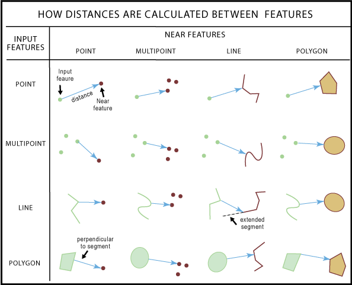

# Overview

## Data

## R packages

```{r}
pacman::p_load(httr, tidyverse, sf, tmap, jsonlite, progress,
               spdep, GWmodel, SpatialML, rsample, Metrics,
               knitr, spatialRF, randomForestExplainer,
               rvest, stringr, lubridate, patchwork, DT)
```

-   httr - allows HTTP calls to OneMap API
-   jsonlite - read json files to tibbular data frame
-   sf - handles geospatial data
-   tmap - handles maps
-   progress - tracks computations

# Data preparation

## Importing data

The following section imports the 25 datasets for this exercise using the relevant functions for the origin file type, namely:

-   `read_csv()` for csv files
-   `st_read` for KML/shp files

Spatial datasets were read in and converted to a sf dataframe using `st_as_sf` where necessary. The spatial datasets where also transformed to SVY21 coordinate reference system using `st_transform()`, for consistency across datasets. This allows us to perform visualisation, spatial analysis and distance computations later in our analysis. For datasets which include Z-coordinates, these coordinates were also dropped using `st_zm()` as our analysis will only require2d spatial geometries. Finally, the datasets are plotted to check that the point/line/polygon features are contained within the boundaries of Singapore's main island.

Additional data processing for specific datasets are specified within their tab.

::: panel-tabset
### MPSZ

```{r}
#| eval: false
mpsz<- st_read("data/MasterPlan2019SubzoneBoundaryNoSeaKML.kml") %>% 
  st_zm(drop = TRUE, what = "ZM") %>% 
  st_transform(crs = 3414)
```

The following code chunk builds the function extract_kml_field, which allows us to parse HTML text to extract values associated with a data field in the text.

```{r}
extract_kml_field <- function(html_text, field_name) {
  if (is.na(html_text) || html_text == "") return(NA_character_)
  
  page <- read_html(html_text)
  rows <- page %>% html_elements("tr")
  
  value <- rows %>%
    keep(~ html_text2(html_element(.x, "th")) == field_name) %>%
    html_element("td") %>%
    html_text2()
  
  if (length(value) == 0) NA_character_ else value
}
```

Using the `extract_kml_field` function, the following code chunk extracts the relevant attribute information from the description field of `mpsz`, and filters the resulting sf dataframe to extract only the geometry associated with Singapore's main island.

```{r}
#| eval: false
mpsz <- mpsz %>%   
  mutate(     
    REGION_N = map_chr(Description, extract_kml_field, "REGION_N"),     
    PLN_AREA_N = map_chr(Description, extract_kml_field, "PLN_AREA_N"),     
    SUBZONE_N = map_chr(Description, extract_kml_field, "SUBZONE_N")) %>%   
  select(-Name, -Description) %>%   
  relocate(geometry, .after = last_col())

mpsz <- mpsz %>%
  filter(SUBZONE_N != "SOUTHERN GROUP",
         PLN_AREA_N != "WESTERN ISLANDS",
         PLN_AREA_N != "NORTH-EASTERN ISLANDS")

write_rds(mpsz, 'data/rds/mpsz.rds')
```

This code chunk plots `mpsz` to check that it is in line with what we wanted.

```{r}
mpsz<- read_rds('data/rds/mpsz.rds')
qtm(mpsz)
```

From `mpsz` we will also create a variable mpsz_sf which merges all connected polygons in `mpsz`. This will allow us to filter other variables to only point/polygon features within the boundary of Singapore's main island, without accidentally removing points/polygons which cross internal boundaries.

```{r}
mpsz_sf <- st_union(mpsz, by_feature = FALSE) %>%
  st_as_sf()
qtm(mpsz_sf)
```

### HDB

This dataset consists of aspatial data. The data was filtered for 4-room flats sold between July 2024 and September 2025, in line with the period of study for this exercise. This data will be geocoded in the next data processing step.

```{r}
HDBresale <- read_csv("data/hdb/HDBresale.csv") %>%
                         filter(flat_type=="4 ROOM") %>%
                         filter(month >= "2024-07" & month <="2025-09")
```

### Bus Stop

```{r}
busstop <- st_read("data/transport/bus/BusStop.shp") %>%
  st_transform(crs=3414)
  
```

There are some bus stops which fall outside the borders of Singapore's main island. The following code chunk uses `st_join` to join both sf objects by `st_within`, which will extract point features of only bus stops in Singapore. By using busstop as the first argument, we preserve the point layer (instead of the `geometry` column from `mpsz`).

```{r}
busstop <- st_join(
  busstop, mpsz_sf,
  join=st_within, #returns TRUE for BusStop locations within the geometry of mpsz_sf
  left=FALSE #remove rows without matches 
) %>%
  select(c("BUS_STOP_N", "geometry"))
```

```{r}
tmap_mode('plot')
qtm(mpsz)+
  qtm(busstop, size = 0.5,  fill='steelblue', add=TRUE)
```

### MRT

```{r}
mrt <- st_read('data/transport/LTAMRTStationExitKML.kml') %>%
  st_transform(crs=3414) %>%
  st_zm(drop = TRUE, what = "ZM") %>%
  select(1,'geometry')
```

```{r}
qtm(mpsz)+
  qtm(mrt, size = 0.5,  fill='steelblue', add=TRUE)
```

### Cycling Path

```{r}
cycling <- st_read('data/transport/CyclingPathNetworkKML.kml') %>%
  st_transform(crs=3414) %>%
  select(1,'geometry')
```

```{r}
qtm(mpsz)+
  qtm(cycling, col='red', add=TRUE)
```

### Taxi Stop

```{r}
taxi <- st_read('data/transport/LTATaxiStopKML.kml') %>%
  st_transform(crs=3414) %>%
  st_zm(drop = TRUE, what = "ZM") %>%
  select(1,'geometry')
```

```{r}
qtm(mpsz)+
  qtm(taxi, size = 0.5,  fill='steelblue', add=TRUE)
```

### Pre-schools

```{r}
preschool <- st_read("data/family-facility/PreSchoolsLocation.kml")%>%
  st_transform(crs=3414) %>%
  st_zm(drop = TRUE, what = "ZM") %>%
  select(1,'geometry')
```

```{r}
qtm(mpsz)+
  qtm(preschool, size = 0.5,  fill='steelblue', add=TRUE)
```

### Kindergartens

```{r}
kindergartens <- st_read("data/family-facility/Kindergartens.kml") %>%
  st_transform(crs=3414) %>%
  st_zm(drop = TRUE, what = "ZM") %>%
  select(1,'geometry')
```

```{r}
qtm(mpsz)+
  qtm(kindergartens, size = 0.5,  fill='steelblue', add=TRUE)
```

### Child Care Services

```{r}
childcare <- st_read("data/family-facility/ChildCareServices.kml") %>%
  st_transform(crs=3414) %>%
  st_zm(drop = TRUE, what = "ZM") %>%
  select(1,'geometry')
```

```{r}
qtm(mpsz)+
  qtm(childcare, size = 0.5,  fill='steelblue', add=TRUE)
```

### Primary Schools

Aside from reading in the data for primary schools, the following code chunk also filters the data to exclude non-primary schools from the dataset, such as secondary schools or high schools. The names were filtered by looking up each name online to confirm which were not primary schools.

This data will be geocoded in the next data processing step.

```{r}
prischool <- read_csv('data/family-facility/Generalinformationofschools.csv')

prischool <- prischool %>%
  filter(!str_detect(school_name, "SECONDARY", negate = FALSE), 
         (!str_detect(school_name, "JUNIOR COLLEGE", negate = FALSE)), 
         !school_name %in%  c('ANGLO-CHINESE SCHOOL (BARKER ROAD)', 'ANGLO-CHINESE SCHOOL (INDEPENDENT)', 'ASSUMPTION ENGLISH SCHOOL', 'ASSUMPTION PATHWAY SCHOOL', 'CHIJ KATONG CONVENT', "CHIJ ST. JOSEPH'S CONVENT", "CHIJ ST. THERESA'S CONVENT", "CRESCENT GIRLS' SCHOOL", "GAN ENG SENG SCHOOL", "HAI SING CATHOLIC SCHOOL", "HWA CHONG INSTITUTION", "MILLENNIA INSTITUTE", "NORTHLIGHT SCHOOL", "RAFFLES INSTITUTION", "SCHOOL OF SCIENCE AND TECHNOLOGY, SINGAPORE", "SCHOOL OF THE ARTS, SINGAPORE", "SINGAPORE CHINESE GIRLS' SCHOOL", "SINGAPORE SPORTS SCHOOL", "ST ANDREW'S SCHOOL (JUNIOR)", "ST. JOSEPH'S INSTITUTION", "ST. PATRICK'S SCHOOL", "TANJONG KATONG GIRLS' SCHOOL","VICTORIA SCHOOL", "BUKIT PANJANG GOVT. HIGH SCHOOL", "CHUNG CHENG HIGH SCHOOL (MAIN)", "CHUNG CHENG HIGH SCHOOL (YISHUN)", "DUNMAN HIGH SCHOOL", "HOLY INNOCENTS' HIGH SCHOOL", "NAN CHIAU HIGH SCHOOL", "NAN HUA HIGH SCHOOL", "NANYANG GIRLS' HIGH SCHOOL", "NUS HIGH SCHOOL OF MATHEMATICS AND SCIENCE", "PRESBYTERIAN HIGH SCHOOL", "RIVER VALLEY HIGH SCHOOL", "ANGLICAN HIGH SCHOOL")) %>%
  select(1,3)
```

### Student Care Services

```{r}
studentcare <- st_read("data/family-facility/StudentCareServicesKML.kml") %>%
  st_transform(crs=3414) %>%
  st_zm(drop = TRUE, what = "ZM") %>%
  select(1,'geometry')
```

```{r}
qtm(mpsz)+
  qtm(studentcare, size = 0.5,  fill='steelblue', add=TRUE)
```

### Elder Care Services

```{r}
eldercare <- st_read('data/family-facility/EldercareServicesKML.kml') %>%
  st_transform(crs=3414) %>%
  st_zm(drop = TRUE, what = "ZM") %>%
  select(1,'geometry')
```

```{r}
qtm(mpsz)+
  qtm(eldercare, size = 0.5,  fill='steelblue', add=TRUE)
```

### CHAS clinics

```{r}
chas <- st_read('data/facilities/CHASClinics.kml') %>%
  st_transform(crs=3414) %>%
  st_zm(drop = TRUE, what = "ZM") %>%
  select(1,'geometry')
```

```{r}
qtm(mpsz)+
  qtm(chas, size = 0.5,  fill='steelblue', add=TRUE)
```

### Eating Establishments

```{r}
food <- st_read("data/facilities/EatingEstablishments.kml") %>%
  st_transform(crs=3414)%>%
  st_zm(drop = TRUE, what = "ZM") %>%
  select(1,'geometry')
```

There are some esting establishments which fall outside the borders of Singapore's main island. The following code chunk uses `st_join` to join both sf objects by `st_within`, which will extract point features of establishments within Singapore's main island.

```{r}
food <- st_join(
  food, mpsz_sf,
  join=st_within, 
  left=FALSE
) %>%
  select(c("Name", "geometry"))
```

```{r}
qtm(mpsz)+
  qtm(food, size = 0.5,  fill='steelblue', add=TRUE)
```

### Hawker Centres

```{r}
hawker <- st_read('data/facilities/HawkerCentresKML.kml') %>%
  st_transform(crs=3414)%>%
  st_zm(drop = TRUE, what = "ZM") %>%
  select(1,'geometry')
```

```{r}
qtm(mpsz)+
  qtm(hawker, size = 0.5,  fill='steelblue', add=TRUE)
```

### Hospitals

```{r}
hospitals <- read_csv('data/facilities/hospitals_with_coordinates.csv') %>%
  select(1,'latitude', 'longitude')
hospitals_sf <- st_as_sf(hospitals, 
                         coords = c("longitude", "latitude"), 
                         crs = 4326) %>%
  st_transform(crs=3414)
```

```{r}
qtm(mpsz)+
  qtm(hospitals_sf, size = 0.5,  fill='steelblue', add=TRUE)
```

### Libraries

```{r}
library <- st_read('data/facilities/Libraries.kml') %>%
  st_transform(crs=3414)%>%
  st_zm(drop = TRUE, what = "ZM") %>%
  select(1,'geometry')
```

```{r}
qtm(mpsz)+
  qtm(library, size = 0.5,  fill='steelblue', add=TRUE)
```

### NEA Market/Food Centres

```{r}
market <- st_read('data/facilities/NEAMarketandFoodCentreKML.kml') %>%
  st_transform(crs=3414)%>%
  st_zm(drop = TRUE, what = "ZM") %>%
  select(1,'geometry')
```

```{r}
qtm(mpsz)+
  qtm(market, size = 0.5,  fill='steelblue', add=TRUE)
```

### Parks

```{r}
parks <- st_read('data/facilities/Parks.geojson') %>%
  st_transform(crs=3414) %>%
  select(1,'geometry')
```

There are some parks which fall outside the borders of Singapore's main island (for example, on Pulau Ubin or Pulau Sekudu). The following code chunk uses `st_join` to join both sf objects by `st_within`, which will extract only parks within Singapore's main island.

```{r}
parks <- st_join(
  parks, mpsz_sf,
  join=st_within, 
  left=FALSE 
) %>%
  select(c("OBJECTID_1", "geometry"))
```

```{r}
qtm(mpsz)+
  qtm(parks, fill='steelblue', add=TRUE)
```

### Pharmacies

```{r}
pharmacy <- st_read('data/facilities/RetailpharmacylocationsKML.KML') %>%
  st_transform(crs=3414) %>% 
  st_zm(drop = TRUE, what = "ZM") %>%
  select(1,'geometry')
```

```{r}
qtm(mpsz)+
  qtm(pharmacy, size = 0.5,  fill='steelblue', add=TRUE)
```

### Shopping Malls

```{r}
malls <- read_csv('data/facilities/singapore_malls_pois.csv') %>%
  select(1,'lon', 'lat')

malls_sf <- st_as_sf(malls, 
                         coords = c("lon", "lat"), 
                         crs = 4326) %>%
  st_transform(crs=3414)

```

```{r}
qtm(mpsz)+
  qtm(malls_sf, size = 0.5,  fill='steelblue', add=TRUE)
```

### Supermarkets

```{r}
supermarket <- st_read('data/facilities/SupermarketsKML.KML') %>%
  st_transform(crs=3414) %>% 
  st_zm(drop = TRUE, what = "ZM") %>%
  select(1,'geometry')
```

```{r}
qtm(mpsz)+
  qtm(supermarket, size = 0.5,  fill='steelblue', add=TRUE)
```

### Neighbourhood Renewal Programme

```{r}
nrp <- st_read('data/hdb/NRPKML.kml') %>%
  st_transform(crs=3414) 
```

```{r}
qtm(mpsz)+
  qtm(nrp,  fill='steelblue', add=TRUE)
```
:::

## Geocoding data

The following code chunk creates the function `geocode()`. The function takes in two string values and concatenates them to form an address which it then uses to query the OneMap API to retrieve latitude and longitude coordinates for that address.

```{r}
geocode <- function(block, streetname) {
  base_url="https://onemap.gov.sg/api/common/elastic/search"
  address<- paste(block, streetname, sep=" ")
  query <- list("searchVal" = address, 
                "returnGeom" = "Y",
                "getAddrDetails" = "N",
                "pageNum" = "1")
  
  res <- GET(base_url,  query = query)
  restext <- content(res, as="text")
  
  output <- fromJSON(restext) %>%
    as.data.frame() %>%
    select(results.LATITUDE, results.LONGITUDE)
  
  return(output)
}
```

THe following section geocodes the `HDBresale` and `prischool` datasets to include latitude and longitude columns for each entry in each respective dataset using the function `geocode`. The newly created latitude and longitude columns are then used to convert the dataframes to *sf* dataframes using `st_as_sf()`, and converts the coordinates to SVY21 projection using `st_transform()` for consistency with the other datasets. Finally, the dataset is visualised using `qtm()` to check that the datapoints all fall within Singapore's main island for our analysis purposes.

::: panel-tabset
### HDB resales

The following code chunk amends 'ST.' in any strings under street_name of HDBresale to 'SAINT' to ensure it is not accidentally read as an abbreviation for 'street'

```{r}
HDBresale$street_name<-gsub(
  "ST\\.", "SAINT", 
  HDBresale$street_name
)
```

```{r}
#| eval: false
HDBresale$LATITUDE <- 0
HDBresale$LONGITUDE <- 0

for (i in 1:nrow(HDBresale)){
  temp_output <- geocode(HDBresale[i,4], HDBresale[i,5])
  HDBresale$LATITUDE[i] <- temp_output$results.LATITUDE
  HDBresale$LONGITUDE[i] <- temp_output$results.LONGITUDE
}
```

```{r}
#| eval: false
write_rds(HDBresale, "data/rds/HDBresale.rds")
```

```{r}
HDBresale<-read_rds('data/rds/HDBresale.rds')

HDBresale_sf <- st_as_sf(HDBresale, 
                         coords = c("LONGITUDE", "LATITUDE"), 
                         crs = 4326) %>%
  st_transform(crs=3414)

```

```{r}
qtm(mpsz)+
  qtm(HDBresale_sf, size = 0.5,  fill='steelblue', add=TRUE)
```

### Primary schools

```{r}
#| eval: false
prischool$LATITUDE <- 0
prischool$LONGITUDE <- 0

for (i in 1:nrow(prischool)){
  temp_output <- geocode(prischool[i,3],'')
  prischool$LATITUDE[i] <- temp_output$results.LATITUDE
  prischool$LONGITUDE[i] <- temp_output$results.LONGITUDE
}
```

```{r}
#| eval: false
write_rds(prischool, 'data/rds/prischool.rds')
```

```{r}
prischool<-read_rds('data/rds/prischool.rds')

prischool_sf <- st_as_sf(prischool, 
                         coords = c("LONGITUDE", "LATITUDE"), 
                         crs = 4326) %>%
  st_transform(crs=3414)
```

```{r}
qtm(mpsz)+
  qtm(prischool_sf, size = 0.5,  fill='steelblue', add=TRUE)
```
:::

## Preparing attribute data

In this section, we will perform feature engineering for each HDB resale datapoint. We will create structural attributes (factors attributable to the HDB flat itself), and locational attributes (factors dependent on proximity to certain amenities/facilities or on the availability of amenities/facilities within a certain distance, i.e., accessibility to that amenity/facility)

-   structural attributes: the code to derive each are explained in its respective tab
-   proximity attributes: derived using `st_nearest feature(x,y)` of **sf** package, which finds the nearest spatial feature in `y` for each feature in `x`, and `st_distance(x,y, by_element=TRUE)` which calculates the distance between each corresponding row of `x` and `y`. As the distance is returned in metres, the value is divided by 1000 to return the from the resold flatdistance to the nearest facility/amenity in kilometres. Refer to the figure below for how the shortest distance is calculated between different types of features.
-   accessibility attributes: derived using `st_is_within_distance(x,y,dist)` which returns a list of features from `x` which a part of falls within a specified maximum distance `dist` (in metres) of a feature in `y`. `map_int()` from **purr** package from **tidyverse** is then used to apply `length()` to each list and count the number of features which falls within the specified distance of the resold flat. [](https://pro.arcgis.com/en/pro-app/3.3/tool-reference/analysis/how-near-analysis-works.htm)

::: panel-tabset
### Month sold order

```{r}
#| eval: false
HDBresale_sf <- HDBresale_sf %>%
  mutate(
    end_date = ymd(paste0(month, "-01")),
    month_order = interval('2024-07-01', end_date) %/% months(1)
  )
```

### Storey level

```{r}
#| eval: false
storey_mapping <- c("01 TO 03" = 1, "04 TO 06" = 2, "07 TO 09" = 3, 
                    "10 TO 12" = 4, "13 TO 15" = 5, "16 TO 18" = 6,
                    "19 TO 21" = 7, "22 TO 24" = 8, "25 TO 27" = 9,
                    "28 TO 30" = 10, "31 TO 33" = 11, "34 TO 36" = 12,
                    "37 TO 39" = 13, "40 TO 42" = 14, "43 TO 45" = 15, 
                    "46 TO 48" = 16, "49 TO 51" = 17)
HDBresale_sf$storey_order <- storey_mapping[HDBresale_sf$storey_range]
```

### Remaining Lease

```{r}
#| eval: false
HDBresale_sf <- HDBresale_sf %>%
  mutate(
    years = as.numeric(str_extract(remaining_lease, "^\\d+")),
    months = as.numeric(str_extract(remaining_lease, "\\d+(?=\\s+month)")) %>%
      replace_na(0),
    remaining_lease_months = (years * 12) + months
  ) %>%
  select(-c(years, months))
```

### Bus Stop

```{r}
#| eval: false
bs_within_350m <- st_is_within_distance(
  HDBresale_sf, busstop_sf, dist=350) #measurement is in meters

HDBresale_sf <- HDBresale_sf %>% 
  mutate(bus_within350m = map_int(bs_within_350m, length))
```

### MRT

```{r}
#| eval: false

HDBresale_sf <- HDBresale_sf %>%
  mutate(
    prox_mrt = as.numeric(
      st_distance(geometry,
                  mrt[st_nearest_feature(
                    geometry, mrt), ], 
                  by_element = TRUE)
      )/1000
    )
```

### Cycling Path

```{r}
#| eval: false

HDBresale_sf <- HDBresale_sf %>%
  mutate(
    prox_cycling = as.numeric(
      st_distance(geometry,
                  cycling[st_nearest_feature(
                    geometry, cycling), ], 
                  by_element = TRUE)
      )/1000
    )
```

### Taxi Stop

```{r}
#| eval: false

HDBresale_sf <- HDBresale_sf %>%
  mutate(
    prox_taxi = as.numeric(
      st_distance(geometry,
                  taxi[st_nearest_feature(
                    geometry, taxi), ], 
                  by_element = TRUE)
      )/1000
    )
```

### Pre-schools

```{r}
#| eval: false

within_350m <- st_is_within_distance(
  HDBresale_sf, preschool, dist=350)
HDBresale_sf <- HDBresale_sf %>% 
  mutate(preschool_within350m = map_int(within_350m, length))
```

### Kindergartens

```{r}
#| eval: false
k_within_350m <- st_is_within_distance(
  HDBresale_sf, kindergartens, dist=350) #measurement is in meters

HDBresale_sf <- HDBresale_sf %>% 
  mutate(kindergarten_within350m = map_int(k_within_350m, length))
```

### Child Care Services

```{r}
#| eval: false

c_within_350m <- st_is_within_distance(
  HDBresale_sf, childcare, dist=350) #measurement is in meters

HDBresale_sf <- HDBresale_sf %>% 
  mutate(childcare_within350m = map_int(c_within_350m, length))
```

### Primary Schools

```{r}
#| eval: false
p_within_1km <- st_is_within_distance(
  HDBresale_sf, prischool_sf, dist=1000) #measurement is in meters

HDBresale_sf <- HDBresale_sf %>% 
  mutate(prischool_within1km = map_int(p_within_1km, length))
```

### Good primary school

```{r}
#| EVAL: FALSE
GPS <- c("METHODIST GIRLS' SCHOOL (PRIMARY)", "TAO NAN SCHOOL", "AI TONG SCHOOL", "HOLY INNOCENTS' PRIMARY SCHOOL", "CHIJ ST. NICHOLAS GIRLS' SCHOOL", "ADMIRALTY PRIMARY SCHOOL", "ST. JOSEPH'S INSTITUTION JUNIOR", "CATHOLIC HIGH SCHOOL", "ANGLO-CHINESE SCHOOL (JUNIOR)", "CHONGFU SCHOOL", "KONG HWA SCHOOL", "ST. HILDA'S PRIMARY SCHOOL", "ANGLO-CHINESE SCHOOL (PRIMARY)", "NAN CHIAU PRIMARY SCHOOL", "NAN HUA PRIMARY SCHOOL", "NANYANG PRIMARY SCHOOL", "PEI HWA PRESBYTERIAN PRIMARY SCHOOL", "KUO CHUAN PRESBYTERIAN PRIMARY SCHOOL", "RULANG PRIMARY SCHOOL", "SINGAPORE CHINESE GIRLS' PRIMARY SCHOOL", "MARIS STELLA HIGH SCHOOL", "FAIRFIELD METHODIST SCHOOL (PRIMARY)", "SOUTH VIEW PRIMARY SCHOOL", "CHIJ PRIMARY (TOA PAYOH)", "HENRY PARK PRIMARY SCHOOL", "PEI CHUN PUBLIC SCHOOL", "XINMIN PRIMARY SCHOOL", "RED SWASTIKA SCHOOL", "ST. ANTHONY'S PRIMARY SCHOOL", "ROSYTH SCHOOL", "PAYA LEBAR METHODIST GIRLS' SCHOOL (PRIMARY)", "NORTHLAND PRIMARY SCHOOL", "PASIR RIS PRIMARY SCHOOL", "MEE TOH SCHOOL", "RADIN MAS PRIMARY SCHOOL", "CHIJ OUR LADY OF THE NATIVITY", "HORIZON PRIMARY SCHOOL","SENGKANG GREEN PRIMARY SCHOOL", "RAFFLES GIRLS' PRIMARY SCHOOL","MAHA BODHI SCHOOL", "ST. ANDREW'S JUNIOR SCHOOL", "KEMING PRIMARY SCHOOL","CHUA CHU KANG PRIMARY SCHOOL", "RIVER VALLEY PRIMARY SCHOOL","ANDERSON PRIMARY SCHOOL","GONGSHANG PRIMARY SCHOOL", "HONG WEN SCHOOL","BUKIT PANJANG PRIMARY SCHOOL", "ST. GABRIEL'S PRIMARY SCHOOL", "FRONTIER PRIMARY SCHOOL", "POI CHING SCHOOL", "CHIJ OUR LADY OF GOOD COUNSEL", "CANOSSA CATHOLIC PRIMARY SCHOOL", "HOUGANG PIRMARY SCHOOL", "WESTWOORD PRIMARY SCHOOL", "QIFA PRIMARY SCHOOL", "TEEMASEK PRIMARY SCHOOL","YU NENG PRIMARY SCHOOL", "ST. MARGARET'S SCHOOL (PRIMARY)", "TANJONG KATONG PRIMARY SCHOOL", "CANBERRA PRIMARY SCHOOL", "INNOVA PRIMARY SCHOOL", "WOODLANDS PRIMARY SCHOOL", "YANGZHENG PRIMARY SCHOOL", "MONTFORD JUNIOR SCHOOL", "RIVERVALE PRIMARY SCHOOL", "COMPASSVALE PRIMARY SCHOOL", "CHIJ (KATONG) PRIMARY", "ST. STEPHEN'S SCHOOL", "SHUQUN PRIMARY SCHOOL", "CHONGZHENG PRIMARY SCHOOL, CHIJ (KELLOCK)", "CHIJ OUR LADY QUEEN OF PEACE", "DE LA SALLE SCHOOL")

gps_sf <- prischool_sf %>%
  filter(school_name %in% GPS)

HDBresale_sf <- HDBresale_sf %>%
  mutate(
    prox_gps = as.numeric(
      st_distance(geometry,
                  gps_sf[st_nearest_feature(
                    geometry, gps_sf), ], 
                  by_element = TRUE)
      )/1000
    )
```

### Student Care Services

```{r}
#| eval: false

HDBresale_sf <- HDBresale_sf %>%
  mutate(
    prox_studentcare = as.numeric(
      st_distance(geometry,
                  studentcare[st_nearest_feature(
                    geometry, studentcare), ], 
                  by_element = TRUE)/1000 #divide by 1000 to get measurement in km
      )
    )
```

### Elder Care Services

```{r}
#| eval: false

HDBresale_sf <- HDBresale_sf %>%
  mutate(
    prox_eldercare = as.numeric(
      st_distance(geometry,
                  eldercare[st_nearest_feature(
                    geometry, eldercare), ], 
                  by_element = TRUE)
      )/1000
    )
```

### CBD

```{r}
#| eval: false

cbd <- mpsz %>%
  filter(PLN_AREA_N=="DOWNTOWN CORE")%>%
  st_union()

HDBresale_sf <- HDBresale_sf %>%
  mutate(
    prox_cbd = as.numeric(
      st_distance(geometry,
                  cbd[st_nearest_feature(
                    geometry, cbd), ], 
                  by_element = TRUE)
      )/1000
    )
```

### CHAS clinics

```{r}
#| eval: false

HDBresale_sf <- HDBresale_sf %>%
  mutate(
    prox_CHAS = as.numeric(
      st_distance(geometry,
                  chas[st_nearest_feature(
                    geometry, chas), ], 
                  by_element = TRUE)
      )/1000
    )
```

### Eating Establishments

```{r}
#| eval: false

f_within_350m <- st_is_within_distance(
  HDBresale_sf, food, dist=350) #measurement is in meters

HDBresale_sf <- HDBresale_sf %>% 
  mutate(foodestablishments_within350m = map_int(f_within_350m, length))
```

### Hawker Centres

```{r}
#| eval: false

HDBresale_sf <- HDBresale_sf %>%
  mutate(
    prox_hawker = as.numeric(
      st_distance(geometry,
                  hawker[st_nearest_feature(
                    geometry, hawker), ], 
                  by_element = TRUE)
      )/1000
    )
```

### Hospitals

```{r}
#| eval: false
HDBresale_sf <- HDBresale_sf %>%
  mutate(
    prox_hospital = as.numeric(
      st_distance(geometry,
                  hospitals_sf[st_nearest_feature(
                    geometry, hospitals_sf), ], 
                  by_element = TRUE)
      )/1000
    )
```

### Libraries

```{r}
#| eval: false
HDBresale_sf <- HDBresale_sf %>%
  mutate(
    prox_library = as.numeric(
      st_distance(geometry,
                  library[st_nearest_feature(
                    geometry, library), ], 
                  by_element = TRUE)
      )/1000
    )
```

### NEA Market/Food Centres

```{r}
#| eval: false 
HDBresale_sf <- HDBresale_sf %>%
  mutate(
    prox_market = as.numeric(
      st_distance(geometry,
                  market[st_nearest_feature(
                    geometry, market), ], 
                  by_element = TRUE)
      )/1000
    )
```

### Parks

```{r}
#| eval: false

HDBresale_sf <- HDBresale_sf %>%
  mutate(
    prox_parks = as.numeric(
      st_distance(geometry,
                  parks[st_nearest_feature(
                    geometry, parks), ], 
                  by_element = TRUE)
      )/1000
    )
```

### Pharmacies

```{r}
#| eval: false
HDBresale_sf <- HDBresale_sf %>%
  mutate(
    prox_pharmacy = as.numeric(
      st_distance(geometry,
                  pharmacy[st_nearest_feature(
                    geometry, pharmacy), ], 
                  by_element = TRUE)
      )/1000
    )
```

### Shopping Malls

```{r}
#| eval: false

HDBresale_sf <- HDBresale_sf %>%
  mutate(
    prox_mall = as.numeric(
      st_distance(geometry,
                  malls_sf[st_nearest_feature(
                    geometry, malls_sf), ], 
                  by_element = TRUE)
      )/1000
    )
```

### Supermarkets

```{r}
#| eval: false

HDBresale_sf <- HDBresale_sf %>%
  mutate(
    prox_supermarket = as.numeric(
      st_distance(geometry,
                  supermarket[st_nearest_feature(
                    geometry, supermarket), ], 
                  by_element = TRUE)
      )/1000
    )
```

### Neighbourhood Renewal Programme

```{r}
#| eval: false
nrp_sf <- nrp %>%
  mutate(
    address = map_chr(Description, extract_kml_field, "NAME"),
    est_cmpltn = map_chr(Description, extract_kml_field, "ESTMT_CNSTRN_CMPLTN")
  ) %>%
  select(-Name, -Description) %>%
  mutate(
    quarter_num = as.numeric(str_extract(est_cmpltn, "^\\d")),
    year_num = str_extract(est_cmpltn, "\\d{4}$"),
    end_month = case_when(
      quarter_num == 1 ~ "03", # Q1 ends in March
      quarter_num == 2 ~ "06", # Q2 ends in June
      quarter_num == 3 ~ "09", # Q3 ends in September
      quarter_num == 4 ~ "12", # Q4 ends in December
      TRUE ~ NA_character_
    ),
    cmpltn_date = paste0(year_num, "-", end_month)
  ) %>%
  # Select the original column and the final date object
  select(address, cmpltn_date, geometry)
```

```{r}
#| eval: false
HDBresale_sf <- HDBresale_sf %>%
  st_join(nrp_sf %>% select(cmpltn_date), left = TRUE) %>%
  mutate(
    nrp_completed = case_when(
      !is.na(cmpltn_date) & (month > cmpltn_date) ~ 1,
      TRUE ~ 0
    )
  ) %>%
  select(-cmpltn_date)
```
:::

## Cleaning up table

The following code chunk cleans up the `HDBresale_sf` dataframe to only the attributes of interest for our analysis in this exercise. This makes the data more readable and is more storage efficient.

```{r}
#| eval: false
HDBresale_sf <- HDBresale_sf %>%
  select(resale_price, floor_area_sqm, month_order, storey_order, 
         remaining_lease_months, prox_mrt, prox_cycling,
         prox_taxi, prox_studentcare, prox_gps, prox_eldercare, prox_cbd,
         prox_CHAS, prox_hawker,
         prox_hospital, prox_library, prox_market, prox_parks,
         prox_pharmacy, prox_mall, prox_supermarket, 
         bus_within350m, preschool_within350m, 
         kindergarten_within350m, childcare_within350m, 
         prischool_within1km, nrp_completed)

write_rds(HDBresale_sf, 'data/rds/HDBresale_sf.rds')
```

```{r}
HDBresale_sf <- read_rds('data/rds/HDBresale_sf.rds')
```

## Creating train/test data sets

We will train our predictive model using HDB resale transaction data from July 2024 to June 2025, to predict resale prices from July to September 2025. The following code chunk splits the dataset into training and test data sets,

GWmodel package struggles with overly large datasets. As `HDBresale_sf`

```{r}
#| eval: false

set.seed(1234)
HDB_train <- HDBresale_sf %>%
  filter(month_order<=11) %>%
  sample_n(3000)
HDB_test  <- HDBresale_sf %>%
  filter(month_order>11) %>%
  sample_n(2000)

write_rds(HDB_train, 'data/rds/HDB_train.rds')
write_rds(HDB_test, 'data/rds/HDB_test.rds')
```

```{r}
HDB_train <- read_rds('data/rds/HDB_train.rds')
HDB_test <- read_rds('data/rds/HDB_test.rds')
```

## Removing overlapping points

when using GWmodel to calibrate explanatory or predictive models, it is important to ensure no overlapping point features

```{r}
overlapping_points<- HDB_train %>%
  mutate(overlap=lengths(st_equals(., .))>1)
sum(overlapping_points$overlap)
```

The code chunk below uses st_jitter of **sf** package to move point features by 1m to avoid overlapping point features

```{r}
HDB_train<-HDB_train %>%
  st_jitter(amount=1)
```

Now, we can check that there are no longer any overlapping points in our training data

```{r}
overlapping_points<- HDB_train %>%
  mutate(overlap=lengths(st_equals(., .))>1)
sum(overlapping_points$overlap)
```

# Exploratory Data Analysis

:::: panel-tabset
## Resale Price Distribution

```{r}
HDBresale_region <- st_join(
  x = HDB_test, # The layer you want to keep all attributes for
  y = mpsz["REGION_N"], # The layer you want to get attributes from (only REGION_N)
  join = st_within, # Specifies a 'points in polygon' join
  left = TRUE # Ensures all original points are kept, even if they fall outside a polygon
)
tm_shape(mpsz) +
    tm_polygons(col_alpha = 0.3)+
tm_facets(by = "REGION_N",
            nrow = 2, 
            ncols = 3,
            free.coords=TRUE, 
            drop.units=TRUE) +
tm_shape(HDBresale_region, group = "REGION_N")+
    tm_dots(fill='resale_price',
            fill.scale = tm_scale_intervals(style = "pretty"),
            fill.legend = tm_legend(),
            fill.chart = tm_chart_histogram())+
tm_facets(by = "REGION_N",
            nrow = 2, 
            ncols = 3,
            free.coords=TRUE, 
            drop.units=TRUE)

```

## Structural Factors

```{r}
structural_factors <- c( "floor_area_sqm", "storey_order", "remaining_lease_months")

plots <- lapply(structural_factors, function(v) {
  ggplot(HDB_train, aes_string(x = v)) +
    geom_histogram(bins = 20, color = "black", fill = "lightblue") +
    labs(title = v, x = NULL, y = NULL) +
    theme_minimal() +
    theme(
      plot.title = element_text(size = 9, hjust = 0.5),
      axis.text = element_text(size = 6)
    )
})

EDA_structural <- wrap_plots(plots, ncol = 4) +
  plot_annotation(title = "EDA of Structural Factors")

EDA_structural
```

## Locational Factors

::: panel-tabset
### Proximity factors

```{r}
#| fig-height: 10

proximity_factors <- c("prox_mrt", "prox_cycling",
         "prox_taxi", "prox_studentcare", "prox_gps", 
         "prox_eldercare", "prox_cbd","prox_CHAS", "prox_hawker",
         "prox_hospital", "prox_library", "prox_market", 
         "prox_parks","prox_pharmacy", "prox_mall", "prox_supermarket"
)

plots <- lapply(proximity_factors, function(v) {
  ggplot(HDB_test, aes_string(x = v)) +
    geom_histogram(bins = 20, color = "black", fill = "lightblue") +
    labs(title = v, x = NULL, y = NULL) +
    theme_minimal() +
    theme(
      plot.title = element_text(size = 9, hjust = 0.5),
      axis.text = element_text(size = 6)
    )
})

EDA_proximity <- wrap_plots(plots, ncol = 4) +
  plot_annotation(title = "EDA of Location & Accessibility Factors")

EDA_proximity
```

### Accessibility factors

```{r}
access_factors <- c("bus_within350m", "preschool_within350m", 
         "kindergarten_within350m", "childcare_within350m", 
         "prischool_within1km", "nrp_completed")

plots <- lapply(access_factors, function(v) {
  ggplot(HDB_test, aes_string(x = v)) +
    geom_histogram(bins = 20, color = "black", fill = "lightblue") +
    labs(title = v, x = NULL, y = NULL) +
    theme_minimal() +
    theme(
      plot.title = element_text(size = 9, hjust = 0.5),
      axis.text = element_text(size = 6)
    )
})

EDA_access <- wrap_plots(plots, ncol = 3) +
  plot_annotation(title = "EDA of Factors related to Accessibility")

EDA_access
```
:::
::::

# Computing Correlation matrix

```{r}
#| fig-width: 10
HDB_train_nogeo <- HDB_train %>%
  st_drop_geometry() 
corrplot::corrplot(cor(HDB_train_nogeo[, 2:17]), 
                   diag = FALSE, 
                   order = "AOE",
                   tl.pos = "td", 
                   tl.cex = 0.5, 
                   method = "number", 
                   type = "upper")
```

# Non Spatial Multiple Linear Regression

```{r}
price_mlr <- lm(resale_price ~ floor_area_sqm + month_order + storey_order + remaining_lease_months + prox_mrt + prox_cycling + prox_taxi + prox_studentcare + prox_gps + prox_eldercare + prox_cbd + prox_CHAS + prox_hawker + prox_hospital + prox_library + prox_market + prox_parks + prox_pharmacy + prox_mall + prox_supermarket + bus_within350m + preschool_within350m + kindergarten_within350m + childcare_within350m + prischool_within1km + nrp_completed,
        data=HDB_train)
summary(price_mlr)
```

```{r}
price_mlr <- lm(resale_price ~ floor_area_sqm + month_order + storey_order + remaining_lease_months + prox_mrt + prox_cycling + prox_taxi + prox_studentcare + prox_gps + prox_eldercare + prox_cbd +  prox_hawker + prox_hospital + prox_market + prox_parks + prox_pharmacy + prox_mall + prox_supermarket + bus_within350m,
                data = HDB_train)
summary(price_mlr)
```

## Prediction

```{r}
mlr_pred <- predict(price_mlr, 
                         newdata=HDB_test) 

predicted_mlr_df <- as.data.frame(mlr_pred)

HDB_test_p<- cbind(
  HDB_test, mlr_pred) %>%
  select(resale_price, mlr_pred)
```

## RMSE calculation

```{r}
mlr_rmse<- rmse(HDB_test_p$resale_price, 
                HDB_test_p$mlr_pred)  %>%
  st_drop_geometry()

mlr_rmse
```

# Geographically Weighted Regression

## Compute adaptive bandwidth for train data

```{r}
#| eval: false
bw_adaptive <- bw.gwr(
  formula = resale_price ~ floor_area_sqm + month_order + storey_order + remaining_lease_months + prox_mrt + prox_cycling + prox_taxi + prox_studentcare + prox_gps + prox_eldercare + prox_cbd +  prox_hawker + prox_hospital + prox_market + prox_parks + prox_pharmacy + prox_mall + prox_supermarket + bus_within350m,
  data=HDB_train,
  approach="CV",
  kernel="gaussian",
  adaptive=TRUE,
  longlat=FALSE
  )
  
write_rds(bw_adaptive, "data/rds/bw_adaptive.rds")
```

```{r}
bw_adaptive <- read_rds("data/rds/bw_adaptive.rds")

bw_adaptive
```

## Calibrate GWR model

```{r}
#| eval: false
gwr_adaptive <- gwr.basic(
  formula = resale_price ~ floor_area_sqm + month_order + storey_order + remaining_lease_months + prox_mrt + prox_cycling + prox_taxi + prox_studentcare + prox_gps + prox_eldercare + prox_cbd +  prox_hawker + prox_hospital + prox_market + prox_parks + prox_pharmacy + prox_mall + prox_supermarket + bus_within350m,
  data=HDB_train,
  bw= bw_adaptive, 
  kernel = 'gaussian', 
  adaptive=TRUE,
  longlat = FALSE)

write_rds(gwr_adaptive, "data/rds/gwr_adaptive.rds")
```

```{r}
gwr_adaptive <- read_rds("data/rds/gwr_adaptive.rds")
gwr_adaptive
```

## Prediction

```{r}
#| eval: false 
gwr_pred <- gwr.predict(
  formula = resale_price ~ floor_area_sqm + month_order + storey_order + remaining_lease_months + prox_mrt + prox_cycling + prox_taxi + prox_studentcare + prox_gps + prox_eldercare + prox_cbd +  prox_hawker + prox_hospital + prox_market + prox_parks + prox_pharmacy + prox_mall + prox_supermarket + bus_within350m,
  data=HDB_train, 
  predictdata = HDB_test, 
  bw=bw_adaptive, 
  kernel = 'gaussian', 
  adaptive=TRUE, 
  longlat = FALSE)

write_rds(gwr_pred, 
          "data/rds/gwr_pred.rds")
```

```{r}
gwr_pred <- read_rds('data/rds/gwr_pred.rds')

gwr_pred_df <- as.data.frame(gwr_pred$SDF)

HDB_test_p<- cbind(HDB_test_p, gwr_pred_df$prediction) %>%
  rename(gwr_pred = gwr_pred_df.prediction) 
```

## RMSE Calculation

```{r}
gwr_rmse <- rmse(HDB_test$resale_price, 
     HDB_test_p$gwr_pred)

gwr_rmse
```

# Random Forest

```{r}
#| eval: false
coords_train <- st_coordinates(HDB_train)
coords_test <- st_coordinates(HDB_test)

write_rds(coords_train, 'data/rds/coords_train.rds')
write_rds(coords_test, 'data/rds/coords_test.rds')
```

```{r}
HDB_train_nogeom <- HDB_train %>% 
  st_drop_geometry()

HDB_test_nogeom <- HDB_test %>% 
  st_drop_geometry()
```

```{r}
#| eval: false
set.seed(1234)

rf <- ranger(
  formula = resale_price ~ floor_area_sqm + month_order + storey_order + remaining_lease_months + prox_mrt + prox_cycling + prox_taxi + prox_studentcare + prox_gps + prox_eldercare + prox_cbd + prox_CHAS + prox_hawker + prox_hospital + prox_library + prox_market + prox_parks + prox_pharmacy + prox_mall + prox_supermarket + bus_within350m + preschool_within350m + kindergarten_within350m + childcare_within350m + prischool_within1km + nrp_completed,
  data=HDB_train_nogeom,
  importance='permutation')

write_rds(rf, "data/rds/rf.rds")

```

```{r}
rf <- read_rds("data/rds/rf.rds")
rf
```

## Variable Importance Analysis

```{r}
rf_importance_scores <- data.frame(
  Feature = names(rf$variable.importance),
  Importance = rf$variable.importance
) %>%
  arrange(desc(Importance)) %>%
  mutate(Feature = factor(Feature, levels = Feature))

```

::: panel-tabset
### Plot

```{r}
ggplot(rf_importance_scores, aes(x = Importance, y = Feature)) +
  geom_col(fill = "steelblue") +
  labs(
    title = "Permutation Variable Importance from RF",
    x = "Feature",
    y = "Importance Score"
  ) +
  theme_minimal() +
  theme(
    plot.title = element_text(hjust = 0.5, face = "bold"),
    axis.text.y = element_text(size = 10)
  )
```

### Data table

```{r}
datatable(rf_importance_scores, rownames = FALSE)%>%
  formatRound(columns = 'Importance', digits = 2)
```
:::

Based on the above observations, we will only pick the top 15 variables for use in our random forest model and the later geographically weighted random forest model.

## Calibrated RF model

```{r}
#| eval: false
set.seed(1234)

rf_c <- ranger(
  formula = resale_price ~ floor_area_sqm + storey_order + remaining_lease_months + prox_mrt + prox_cycling + prox_taxi + prox_gps + prox_eldercare + prox_cbd + prox_hawker + prox_hospital + prox_library + prox_market + bus_within350m + prischool_within1km,
  data=HDB_train_nogeom,
  importance='permutation')

write_rds(rf_c, "data/rds/rf_c.rds")

```

```{r}
rf_c <- read_rds("data/rds/rf_c.rds")
rf_c
```

## Predictions

```{r}
#| eval: false
rf_pred <- predict(rf_c, data=HDB_test_nogeom)

rf_pred_df <- as.data.frame(rf_pred)

write_rds(rf_pred_df, "data/rds/rf_pred_df")
```

```{r}
rf_pred_df<- read_rds("data/rds/rf_pred_df")

HDB_test_p<- cbind(HDB_test_p, rf_pred_df$prediction) %>%
  rename(rf_pred = rf_pred_df.prediction) 
```

## Calculate RMSE

```{r}
rf_rmse <- rmse(HDB_test_p$resale_price, 
     HDB_test_p$rf_pred)

rf_rmse
```

# Geographically Weighted Random Forest Model

## Compute adaptive bandwidth

```{r}
#| eval: false

grf_bw <- grf.bw(
  formula = resale_price ~ floor_area_sqm + storey_order + remaining_lease_months + prox_mrt + prox_cycling + prox_taxi + prox_gps + prox_eldercare + prox_cbd +  prox_hawker + prox_hospital + prox_library + prox_market + bus_within350m + prischool_within1km,
  dataset=HDB_train_nogeom,
  coords=coords_train,
  bw.min = 50, 
  bw.max = 501  , 
  step = 50,
  kernel='adaptive' )
write_rds(grf_bw, 'data/rds/grf_bw.rds')
```

```{r}
grf_bw <- read_rds('data/rds/grf_bw.rds')
grf_bw
```

## Create geographically weighted random forest model

```{r}
#| eval: false

set.seed(1234)

coords_train <- read_rds('data/rds/coords_train.rds')

gwRF_adaptive <- grf(
  formula =  resale_price ~ floor_area_sqm + storey_order + remaining_lease_months + prox_mrt + prox_cycling + prox_taxi + prox_gps + prox_eldercare + prox_cbd +  prox_hawker + prox_hospital + prox_library + prox_market + bus_within350m + prischool_within1km,
  dframe=HDB_train_nogeom, 
  bw=350,
  kernel="adaptive",
  coords=coords_train)

write_rds(gwRF_adaptive, "data/rds/gwRF_adaptive.rds")
```

```{r}
#| eval: false
gwRF_adaptive <- read_rds("data/rds/gwRF_adaptive.rds")
gwRF_adaptive
```

## Predictions

```{r}
coords_test <- read_rds('data/rds/coords_test.rds')

HDB_test_nogeom <- cbind(
  HDB_test, coords_test) %>%
  st_drop_geometry()
```

```{r}
#| eval: false
gwRF_pred <- predict.grf(gwRF_adaptive, 
                           HDB_test_nogeom, 
                           x.var.name="X",
                           y.var.name="Y", 
                           local.w=1,
                           global.w=0)

gwRF_pred <- write_rds(gwRF_pred, "data/rds/gwRF_pred.rds")
```

```{r}
gwrf_pred <- read_rds("data/rds/GRF_pred.rds") 

gwrf_pred <- as.data.frame(gwrf_pred)

HDB_test_p <- cbind(HDB_test_p, gwrf_pred) 
```

## Calculation of RMSE

```{r}
gwrf_rmse <- rmse(HDB_test_p$resale_price, 
     HDB_test_p$gwrf_pred)
 
gwrf_rmse
```

# Evaluation of models

In this section, we will evaluate the performance of the 4 models used to predict prices of 4-room HDB flats from July to September 2025.

The following code chunk creates a dataframe

```{r}
rmse_results <- data.frame(
  Model = c("Multiple Linear Regression",
            "Geographically Weighted Regression",
            "Random Forest",
            "Geographically Weighted Random Forest"),
  RMSE  = c(mlr_rmse,
            gwr_rmse,
            rf_rmse,
            gwrf_rmse)
  )

datatable(rmse_results)%>%
  formatRound(columns = 'RMSE', digits = 2)

```

## Visualising Residuals Distribution

```{r}
residuals<- HDB_test_p %>%
  mutate(mlr=resale_price-mlr_pred,
         gwr=resale_price-gwr_pred, 
         rf=resale_price-rf_pred,
         gwrf=resale_price-gwrf_pred)
```

```{r}
residuals_long <- residuals %>%
  pivot_longer(
    cols = c(mlr, gwr, rf, gwrf), 
    names_to = "Model",
    values_to = "Residuals" 
  ) %>%
  mutate(
    Model = factor(Model, levels = c("mlr", "gwr", "rf", "gwrf"))
  )

violin_plot <- ggplot(residuals_long, aes(x = Model, y = Residuals, fill = Model)) +
  geom_violin(
    trim = TRUE,          
    draw_quantiles = 0.5, 
    alpha = 0.7           
  ) +
  geom_hline(yintercept = 0, linetype = "dashed", color = "red", linewidth = 0.5) +
  coord_flip() +
    labs(
    title = "Comparison of Residual Distributions",
    subtitle = "",
    x = "Prediction Model",
    y = "Residual Value (Actual Price - Predicted Price)",
    fill = "Model"
  ) +
  # Apply a clean theme
  theme_minimal() +
  theme(legend.position = "none") # Hide the redundant legend
# Display the plot

print(violin_plot)
```

## Spatial distribution of Residuals

```{r}
residuals_region <- st_join(
  x = residuals_long,
  y = mpsz["REGION_N"], 
  join = st_within, 
  left = TRUE 
)
```

```{r}
get_residual_map <- function(model){
  sf <- residuals_region %>%
    filter(Model==model)
  
  map <- tm_shape(mpsz) +
            tm_polygons(col_alpha = 0.3)+
        tm_facets(by = "REGION_N",
                    nrow = 2, 
                    ncols = 3,
                    free.coords=TRUE, 
                    drop.units=TRUE) +
        tm_shape(sf, group = "REGION_N")+
            tm_dots(fill='Residuals',
                    fill.scale = tm_scale_intervals(
                      style = "fixed",
                      breaks = c(-300000,-200000,-100000,0,100000,200000,300000,400000),
                      values = "-tableau.red_blue_diverging"))+
        tm_facets(by = "REGION_N",
                    nrow = 2, 
                    ncols = 3,
                    free.coords=TRUE, 
                    drop.units=TRUE)
  return(map)
}
```

::: panel-tabset
### MLR

```{r}
  get_residual_map('mlr')
```

### GWR

```{r}
  get_residual_map('gwr')
```

### RF

```{r}
  get_residual_map('rf')
```

### GWRF

```{r}
  get_residual_map('gwrf')
```

# Conclusion

# Further Work

# References

1.  https://www.kaggle.com/datasets/muhdirshath/hospitals-in-singapore/data
2.  https://www.kaggle.com/datasets/sunnysharma432/singapore-malls-pois/data
3.  <https://www-jstor-org.libproxy.smu.edu.sg/stable/pdf/45389328>
4.  <https://personal.ntu.edu.sg/qfeng/BianChenFengLi20200804paper.pdf>
5.  <https://blogs.ubc.ca/zhuanlim/files/2022/07/Lim_Zhuan_A0224991X.pdf> How proximity tools calculate distance—ArcGIS Pro \| Documentation. (2025). Arcgis.com. https://pro.arcgis.com/en/pro-app/3.3/tool-reference/analysis/how-near-analysis-works.htm
:::
